class: center, middle, inverse, title-slide

# Programming in R: a brief introduction
### Alex Pacheco and Jeremy Mack
### February 28, 2020

---

### About this presentation

 * This course is a **brief introduction** into R.
 
 * It is targeted at people that have little to no experience
   progamming.
   
 * It could be useful for people who learned R some time ago and
   forgot it, or who are not familiar with modern R programming
   (`tidyverse`).
   
 * It focuses on a bit of history, an introduction to the R 
   environment, and some hands experience with **data wrangling**.
   
---

### Structure of the presentation

The presentation is split into five topics:

 * **Topic 1:** What is R? Why use it?
 
 * **Topic 2:** What is RStudio? Why use it?
 
 * **Topic 3:** Getting started with R and RStudio
 
 * **Topic 4:** Programming in R
 
 * **Topic 5:** Data and data wrangling
 
 * **Topic 6:** Plotting
 
 * **Topic 7:** Other things to do with R

---
class: center, middle, inverse

#### Topic 1: What is R? Why use it?
<br/><br/>
<br/><br/>
<br/><br/>
<br/><br/>
<br/><br/>
<br/><br/>
---

#### Topic 1: What is R? Why use it?

.pull-left[

]

.pull-right[
- R is a *programming language* [(one of many)](<https://www.tiobe.com/tiobe-index/>) and an *environment* for statistical computing.
]
   
---

#### Topic 1: What is R? Why use it?

.pull-left[

]

.pull-right[
- R is a *programming language* [(one of many)](<https://www.tiobe.com/tiobe-index/>) and an *environment* for statistical computing.
   
- Developed by Ross Ihaka and Robert Gentleman 27 years ago; it is now developed by a core team supported by the R Foundation.
]
   
---

#### Topic 1: What is R? Why use it?

.pull-left[

]

.pull-right[
- R is a *programming language* [(one of many)](<https://www.tiobe.com/tiobe-index/>) and an *environment* for statistical computing.
   
- Developed by Ross Ihaka and Robert Gentleman 27 years ago; it is now developed by a core team supported by the R Foundation.

- Dialect of the S language (S-Plus)
]
   
--

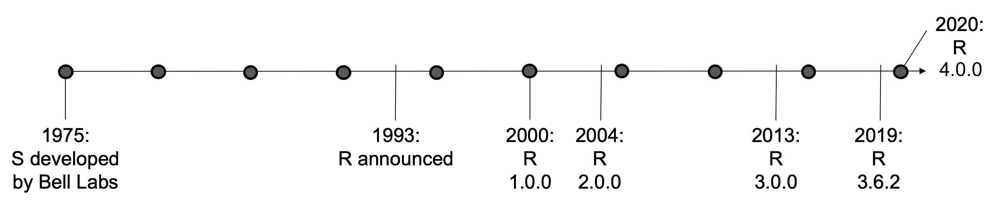

---

#### Topic 1: What is R? Why use it?

.pull-left[

]

.pull-right[
- **Free!**
]

---

#### Topic 1: What is R? Why use it?

.pull-left[

]

.pull-right[
- **Free!**

- Rich data analysis and visualization options
]

---

#### Topic 1: What is R? Why use it?

.pull-left[

]

.pull-right[
- **Free!**

- Rich data analysis and visualization options

- Available on most platforms/OS
]

---

#### Topic 1: What is R? Why use it?

.pull-left[

]

.pull-right[
* **Free!**

* Rich data analysis and visualization options

* Available on most platforms/OS

* *Very* active development community
    + CRAN: The Comprehensive R Archive Network
    + User contributed packages (> 15,000)
]

---

#### Topic 1: What is R? Why use it?

.pull-left[

]

.pull-right[
* **Free!**

* Rich data analysis and visualization options

* Available on most platforms/OS

* *Very* active development community
  + CRAN: The Comprehensive R Archive Network
  + User contributed packages (> 15,000)

* Reproducibility
]

---
class: center, middle, inverse

#### Topic 2: What is RStudio? Why use it?
<br/><br/>
<br/><br/>
<br/><br/>
<br/><br/>
<br/><br/>
<br/><br/>
---

#### Topic 2: What is RStudio? Why use it?

.pull-left[

]

.pull-right[
* RStudio is an *Integrated Development Environment* (IDE), or a front end platform
to work with R.
]

---

#### Topic 2: What is RStudio? Why use it?

.pull-left[

]

.pull-right[
* RStudio is an *Integrated Development Environment* (IDE), or a front end platform
to work with R.
   
* Why would you use RStudio?

  + Like R, it's free!
  + It can reduce the learning curve of R.
  + Integrates nicely with other things (version control, ShinyApps, R Markdown, etc.)
]

---

#### Topic 2: What is RStudio? Why use it?

How do R and RStudio work together? Consider a car analogy.

--

.pull-left[


]

.pull-right[
* **RStudio - the frame**
 + RStudio provides a frame that keeps things organized and finishings that make it visualling appealing.

* **R - the engine**
 + R runs things under the hood - it's the enginge that allows the car to drive.

]

---
class: inverse

#### Review - R and RStudio:
* R is a programming language built for statistical computing.

* It's open source and it's free.

* RStudio is an integrated development envrionment that makes working with R easier.

* It's developed by a company, but it's also free.

---

class: center, middle, inverse

#### Topic 3: Getting started with R and RStudio
<br/><br/>
<br/><br/>
<br/><br/>
<br/><br/>
<br/><br/>
<br/><br/>
---

#### Topic 3: Getting started with R and RStudio

* How do I get R, or RStudio?

 + You can download R on its own through the [R Project website](https://www.r-project.org).
   
 + You can download RStudio, including R,
   at the [RStudio website](https://rstudio.com/products/rstudio/download/).
   
---

#### Topic 3: Getting started with R and RStudio
   
* R and RStudio at Lehigh

 + Both R and RStudio are available on [LUapps](https://luapps.lehigh.edu), a virtualized software system that allows users to use software programs, without having to download them to their machine.
 
 + LUapps can be accessed both on campus and off-campus (over VPN).

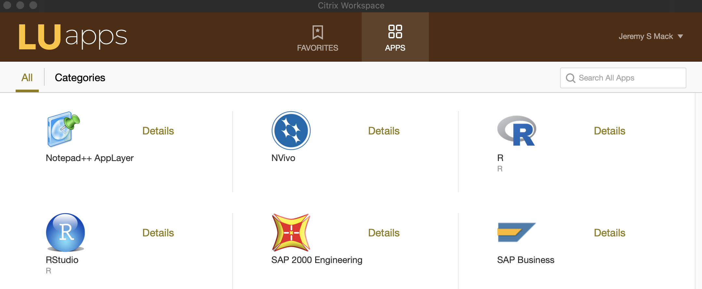

---

#### Topic 3: Getting started with R and RStudio

First, lets explore RStudio.

[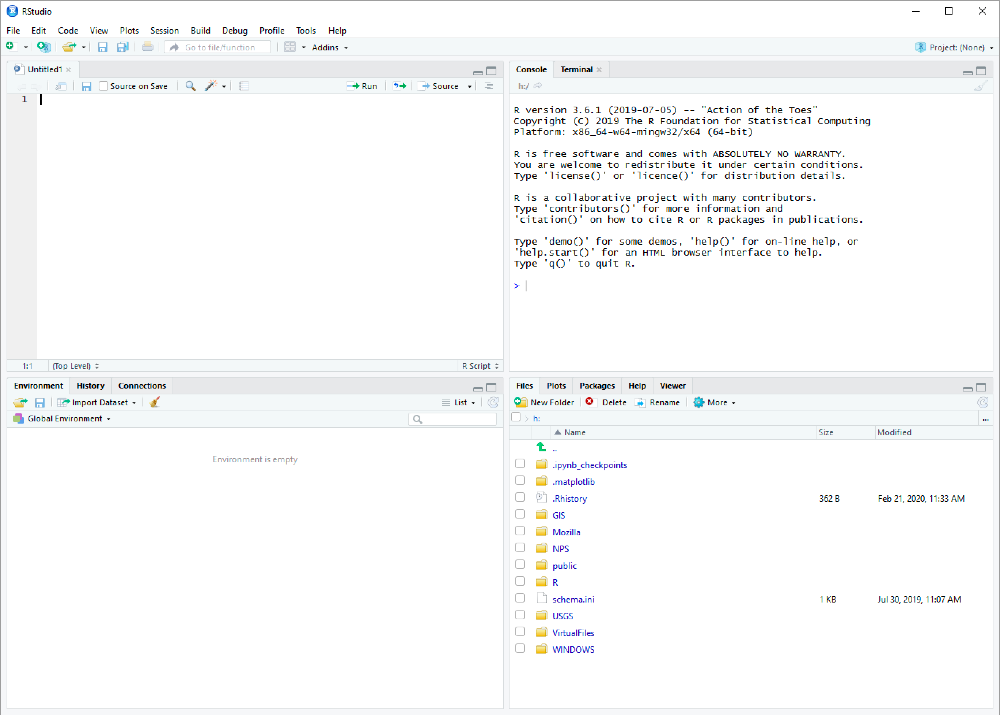](https://luapps.lehigh.edu)

---

#### Topic 3: Getting started with R and RStudio

First, let's explore RStudio.

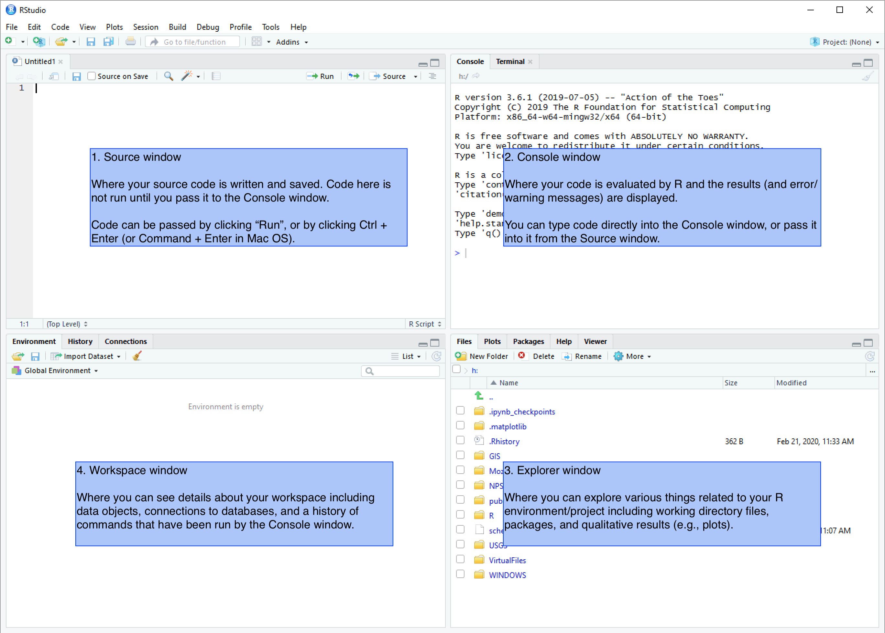

---

#### Topic 3: Getting started with R and RStudio

Next, let's explore R - the engine under the hood.

In true computer science fashion, let's first try typing:

```{r eval=FALSE}
print("Hello world!")
```

What happend?

--

```{r echo=FALSE, comment=NA}
print("Hello world!")
```

---

#### Topic 3: Getting started with R and RStudio

Two things to note:

- We didn't just get "Hello world!", we also got `[1]`. This is R's way
of printing to the screen; it's telling us the position we're at.

- We didn't need to put anything at the end of the line, we just hit return.

---

#### Topic 3: Getting started with R and RStudio

Now, let's try three things...

Try capitalizing `Print(...)`:
 
```{r eval=FALSE}
Print("Hello world!")
```

Try putting a space between `print` and `("Hello world!")`:

```{r eval=FALSE}
print ("Hello world!")
```

Try just entering `"Hello world!"`:

```{r eval=FALSE}
"Hello world!"
```

What happened?

--
 
```{r echo=FALSE, error=TRUE, comment=NA}
Print("Hello world!")
```

```{r echo=FALSE, comment=NA}
print ("Hello world!")
```

```{r echo=FALSE, comment=NA}
"Hello world!"
```

---

#### Topic 3: Getting started with R and RStudio

Three things you just learned:

 - R is **case-sensitive**.
 
 - R does not care about **whitespace**.
 
 - R will **print** results by default.

---

#### Topic 3: Getting started with R and RStudio

You can also use R as a calculator. Let's try the following:

```{r eval=FALSE}
2 + 2
```
--
```{r echo=FALSE, comment=NA}
2 + 2
```
--
```{r eval=FALSE}
4 * 2
```
--
```{r echo=FALSE, comment=NA}
4 * 2
```
--
```{r eval=FALSE}
8 / 3
```
--
```{r echo=FALSE, comment=NA}
8 / 3
```
--
```{r eval=FALSE}
exp(log(8)-log(3))
```
--
```{r echo=FALSE, comment=NA}
exp(log(8)-log(3))
```

---
#### Topic 3: Getting started with R and RStudio
#### Assignments

We often want to save the results of our calculations, rather than print them to the screen. To do so, 
we'll use the **assignment operator**, `<-`

Here's an example:

```{r}
x <- log(8)
y <- log(3)
```
--
Now we can redo our last calculation using the assignments:

```{r comment=NA}
exp(x-y)
```

---
#### Topic 3: Getting started with R and RStudio
#### Concatenation

We will often want to work on sequences of values, rather than specific values. 

To do so, we'll use the **concatenation operator**, `c(...)`

Here's an example:

```{r}
n <- c(2, 3, 5, 8, 13, 21, 34, 55)
```

--

We can now apply opertions across the entire vector.

For example:

```{r comment=NA}
n * 2
```

---
#### Topic 3: Getting started with R and RStudio
#### Logicals

It can be useful to know whether our values meet certain conditions. 

In addition to **character values** (which we saw when we called `print("Hello world!")`), R also allows **logical values**, or `TRUE` and `FALSE`.

For example, we can check which numbers in our "n" vector are double digit:

```{r comment=NA}
n
is_double_digit <- n > 9
is_double_digit
```

---
class: inverse

#### Review - Getting started with R and RStudio:
* RStudio has four main windows to keep things organized.

* R is **case-sensitive**.

* R is a calculator.

* R can be used to store objects that can be compared to other objects, or used with other functions.

---
class: center, middle, inverse

#### Topic 4: Objects and Functions
<br/><br/>
<br/><br/>
<br/><br/>
<br/><br/>
<br/><br/>
<br/><br/>

---

#### Topic 4: Objects and Functions

R revolves around two things: **objects** and **functions**. Almost everything in R is either an object or a function.

<center><b>Define objects > Apply functions > Repeat!</b></center>

--

For example, we can define a simple object called "n":

```{r}
n <- c(2, 3, 5, 8, 13, 21, 34, 55)
```

--

We can then apply a function to our object. Lets say we're interested in the average, so we'll apply the mean function:

```{r comment=NA}
mean(n)
```

---
#### Topic 4: Objects and Functions

Objects in R:
* Objects come in many different shapes and sizes - like a number, a dataset, a summary statistic, or the results of a statistical test.

--

* Objects have different **attributes** - properties that explain what an object represents and how it should be interpreted.

--

* Objects are essentially *data* that have a particular **type** and **structure**.

--

* There are five basic types in R:
 1. Numeric
 2. Integer
 3. Complex
 4. Logical
 5. Character
 
---
#### Topic 4: Objects and Functions

Objects in R - data types:
* Numeric - a number; default data type in R
 
```{r comment=NA}
x <- 10.5               # Define object x
x                       # Print x
class(x)                # Print the class name of x
```

---
#### Topic 4: Objects and Functions

Objects in R - data types:
* Integer - whole numbers; a number that is not a fraction

```{r comment=NA}
x <- 10                 # Define object x
x                       # Print x
class(x)                # Print the class name of x
```
---
#### Topic 4: Objects and Functions

Objects in R - data types:
* Integer - whole numbers; a number that is not a fraction

```{r comment=NA}
x <- as.integer(10)     # Convert to integer
x                       # Print x
class(x)                # Print the class name of x
```
--
```{r comment=NA}
x <- 10L                # Declare as integer by appending with "L"
x                       # Print x
class(x)                # Print the class name of x
```

---
#### Topic 4: Objects and Functions

Objects in R - data types:
* Complex - any number that can be written as a + bi, where *i* is the imaginary unit and a and b
are real numbers.

```{r, comment=NA}
x <- 1 + 2i             # create a complex number x
x                       # print the value of x 
class(x)                # Print the class name of x
```

---
#### Topic 4: Objects and Functions

Objects in R - data types:
* Logical - created via comparison(s) between variables.

```{r, comment=NA}
x <- 1; y <- 2          # create sample values x and y
z <- x > y              # is x larger than y? 
z                       # print the logical value 
class(z)                # Print the class name of z
```

---
#### Topic 4: Objects and Functions

Objects in R - data types:
* Character - used to represent string values in R.

```{r, comment=NA}
x <- as.character(3.14) # Convert to character
x                       # print the character string 
class(x)                # Print the class name of x
```
--
```{r comment=NA}
x <- "3.14"             # Can declare as character with " "
x                       # Print x
class(x)                # Print the class name of x
```
---
#### Topic 4: Objects and Functions

Objects in R - data structure:

.pull-left[
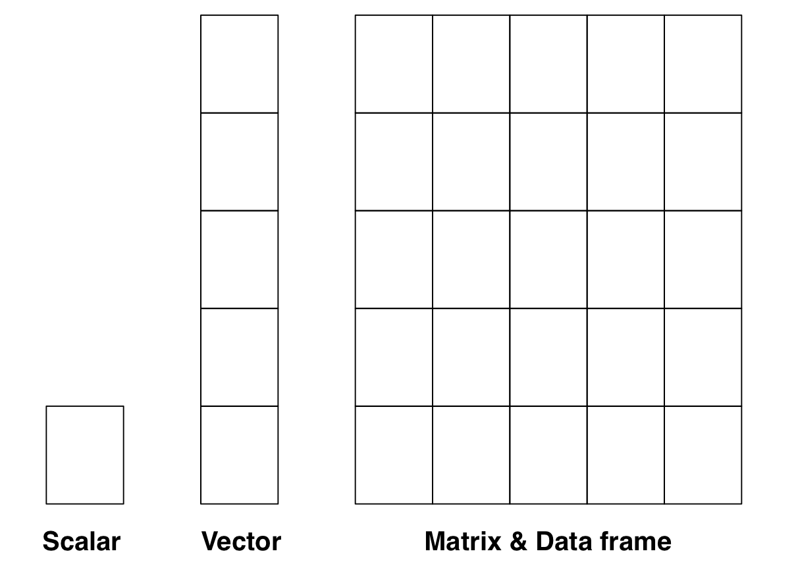
]

.pull-right[
There are four types of data structures:
* Scalar
   
* Vector

* Matrix

* Data frame
]

---
#### Topic 4: Objects and Functions

Objects in R - data structure:

.pull-left[
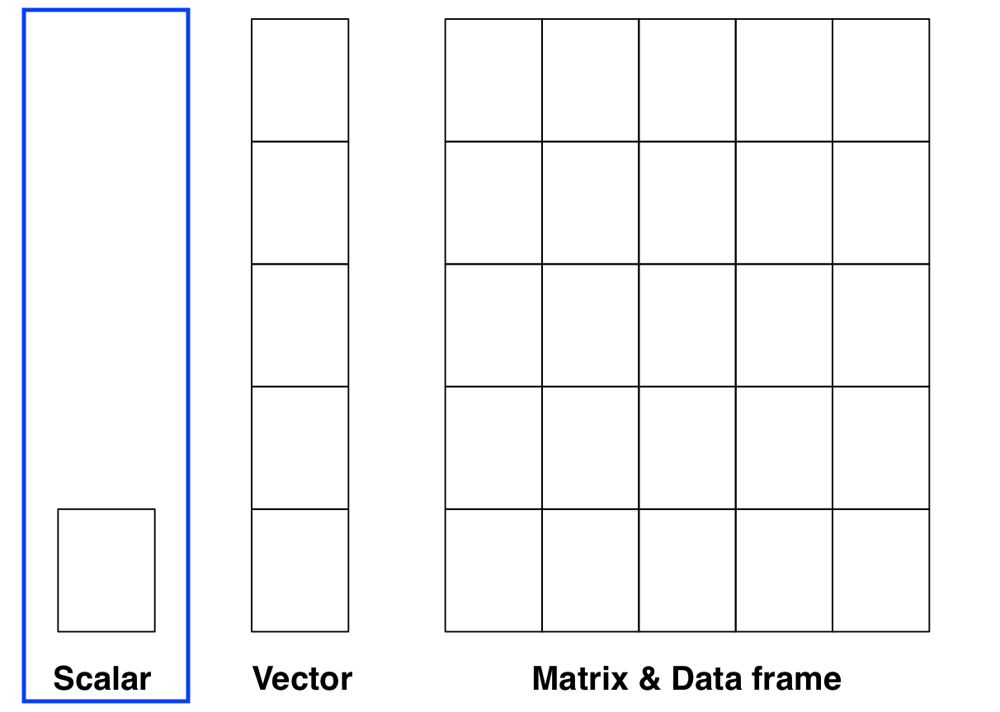
]

.pull-right[
**Scalar objects:**
1. Hold only one value at a time.
 
2. Can be either numeric or character (but not both!).
 
3. Can be used to build more complex objects.

]
---
#### Topic 4: Objects and Functions

Objects in R - data structure:

.pull-left[

]

.pull-right[
**Scalar objects:**
```{r comment=NA}
x <- 10.5 
x
str(x)
```

]

---
#### Topic 4: Objects and Functions

Objects in R - data structure:

.pull-left[
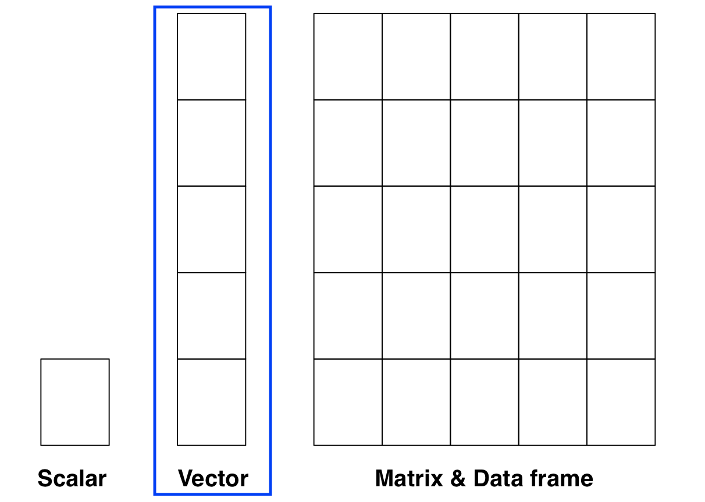
]

.pull-right[
**Vector objects:**
1. Hold several values stored as a single object.
 
2. Can be either numeric or character (but not both!).

]
---
#### Topic 4: Objects and Functions

Objects in R - data structure:

.pull-left[

]

.pull-right[
**Vector objects:**
```{r comment=NA}
n <- c(2,3,5,8,13,21,34,55) 
n
str(n)
```

]

---
#### Topic 4: Objects and Functions

Objects in R - data structure:

.pull-left[

]

.pull-right[
**Vector objects:**
```{r comment=NA}
n <- c(2,3,5,8,13,21,34,"55") 
n[1:6]
class(n)
```

]

---
#### Topic 4: Objects and Functions

Objects in R - data structure:

.pull-left[
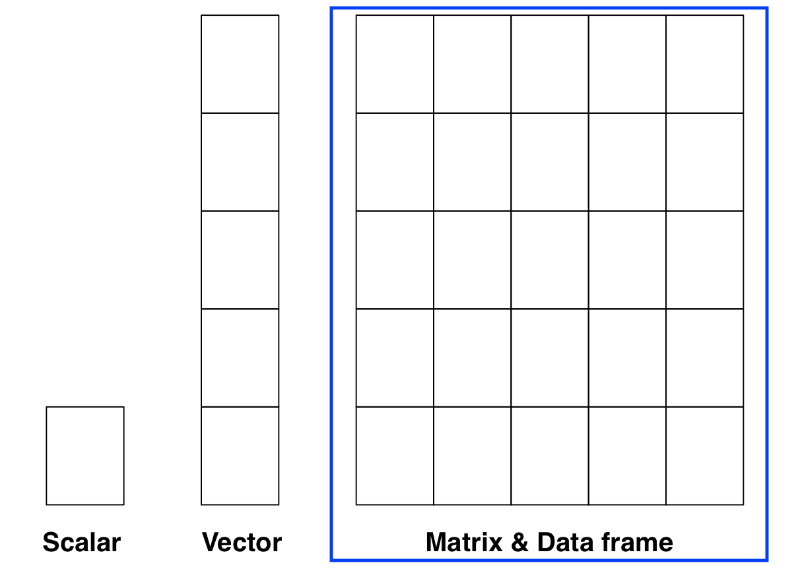
]

.pull-right[
**Matrix objects:**
1. Large data structures.
 
2. Has 2-dimensions, representing its width and height.
 
3. Can be either numeric or character (but not both!).

] 
---
#### Topic 4: Objects and Functions

Objects in R - data structure:

.pull-left[

]

.pull-right[
**Matrix objects:**
```{r comment=NA}
x <- 1:3
y <- 4:6
z <- 7:9
cbind(x,y,z)
rbind(x,y,z)
```

] 
---
#### Topic 4: Objects and Functions

Objects in R - data structure:

.pull-left[

]

.pull-right[
**Data frame objects:**
1. Large data structures.
 
2. Has 2-dimensions, representing its width and height.
 
3. Can be a mix of data types.

] 
---
#### Topic 4: Objects and Functions

Objects in R - data structure:

.pull-left[

]

.pull-right[
**Data frame objects:**
```{r, comment=NA}
survey <- data.frame(
"index" = c(1,2,3,4,5),
"sex" = c("m","m","m","f","f"),
"age" = c(99,46,23,54,23))
```

```{r, comment=NA}
survey
```
]
---
class: inverse

#### Review - Objects:
* Define objects > Apply functions > Repeat!

* Objects are defined by data, which there are five main types.

* Objects come in different sizes and shapes, from a single, scalar, object, to a data frame that contains multiple vectors of different data types.

---
#### Topic 4: Objects and Functions

R revolves around two things: **objects** and **functions**. Almost everything in R is either an object or a function.

<center><b>Define objects > Apply functions > Repeat!</b></center>

---
#### Topic 4: Objects and Functions

Functions in R:

* Functions are procedures that typically take one or more objects as **arguments** (i.e., inputs), does something with them, then returns a new object (i.e., result).

--

* Functions vary in complexity - like computing a mean, to a statistical test.

--

* How do we get functions loaded into R?
 1. Write your own.

 2. Community development (**Packages**)!

---
#### Topic 4: Objects and Functions

Packages in R:

* R packages are collections of functions developed by the [R community](<https://cran.case.edu>).

--

* Packages also include data sets, help documentation, and how-to examples (i.e., vignette).

--

* When you download and install R for the first time, you are installing the **base R** - only functions written by the original authors of the R language.

--

* How de we get ~~functions~~ packages loaded into R?

---
#### Topic 4: Objects and Functions

Packages in R:

* How de we get packages loaded into R?

 + Programmatically
```{r comment=NA, eval=FALSE}
 install.packages("ggplot2")
```
--
 + RStudio Explorer window
 
  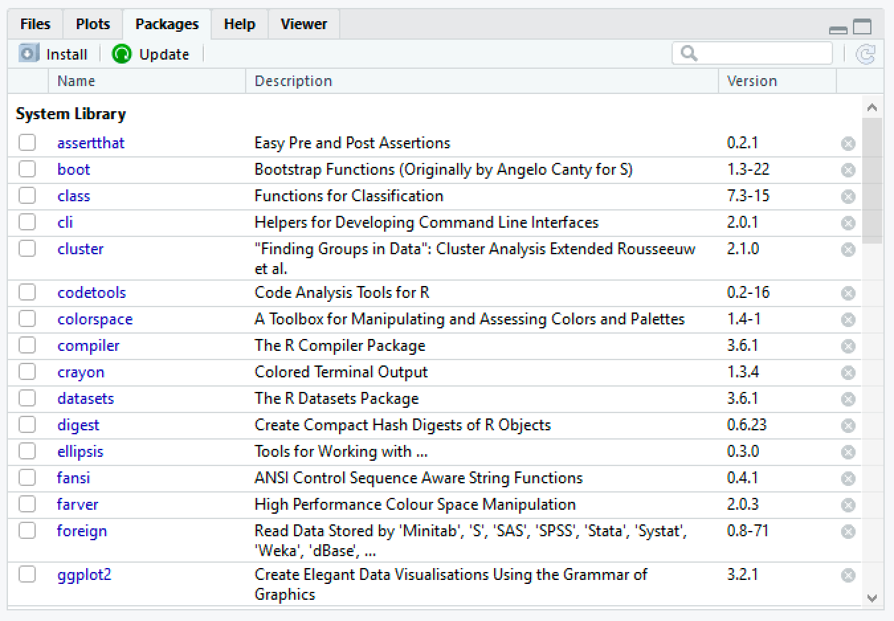
 
---
class: inverse

#### Review - Functions and Packages:
* Define objects > Apply functions > Repeat!

* Functions are used to work with objects in R and are loaded via packages.

* Standard functions are a part of base R, a series of packages that load automatically when R is opened.

* There is a large community of users that develop packages for R.

* Packages can be loaded with install.packages(...), or in the Explorer window in RStudio.

---
class: center, middle, inverse

#### Topic 5: Data and Data Wrangling
<br/><br/>
<br/><br/>
<br/><br/>
<br/><br/>
<br/><br/>
<br/><br/>
---
#### Topic 5: Data and Data Wrangling

Basic steps to working with data in R:

--

 * Check and/or set a working directory.

--

  + What is my working directory?
```{r, comment=NA}
   getwd()         # Prints current working directory
```

---
#### Topic 5: Data and Data Wrangling

Basic steps to working with data in R:

 * Check and/or set a working directory.
 
  + How do I set my working directory?
```{r, comment=NA, eval=FALSE}
   setwd("h:/R")   # Sets path to working directory
   getwd()         # Prints current working directory
```

```
   [1] "h:/R"
```

---
#### Topic 5: Data and Data Wrangling

Basic steps to working with data in R:

 * Check and/or set a working directory.
 
  + How do I set my working directory?
```{r, comment=NA, eval=FALSE}
   setwd("h:/R")   # Sets path to working directory
   getwd()         # Prints current working directory
```

```
   [1] "h:/R"
```

  + Can also set working directory in RStudio
   
     1. Session > Set Working Directory > Choose Directory...
     
     2. Explorer window > More > Set As Working Directory
   
---
#### Topic 5: Data and Data Wrangling

Basic steps to working with data in R:

 * Check and/or set a working directory.

 * Load data.

--
 
  + Programmatically:
```{r, comment=NA, eval=FALSE}
   read.table()   # base R
   read.csv()     # base R
   read.delim()   # base R
   read_xlsx()    # Available with readxl package
```

---
#### Topic 5: Data and Data Wrangling

Basic steps to working with data in R:

 * Check and/or set a working directory.

 * Load data.
 
  + Programmatically:
```{r, comment=NA, eval=FALSE}
   read.table()   # base R
   read.csv()     # base R
   read.delim()   # base R
   read_xlsx()    # Available with readxl package
```
   
   + Can also load data in RStudio
   
     1. File > Import Dataset
     
     2. Workspace window > Import Dataset

---
#### Topic 5: Data and Data Wrangling

Basic steps to working with data in R:

 * Check and/or set a working directory.

 * Load data.
 
 * Explore data!

---
#### Topic 5: Data and Data Wrangling

Exploring Data in R

 * Let's explore data in R.
 
--
 
 * We'll use a dataset from the web to practice saving to and loading from a working directory.
 
--

 * Basic steps:
  
   1. Set working directory.
   
   2. Load data.
   
   3. Explore data!
 
---
#### Topic 5: Data and Data Wrangling

Exploring Data in R

 * First, using the Explorer window in RStudio, create a folder called "R".

--

 * Next, we'll set our working directory and download our dataset:
```{r, comment=NA, eval=FALSE}
   # Set working directory
   setwd("h:/R")
   
   # Set url link for data download
   url <- "https://wordpress.lehigh.edu/jsm4/files/2020/02/mpg.txt"
   
   # Download file to working directory
   download.file(url, "mpg.txt")
```
   
--

 * Now, let's load our data:
```{r, comment=NA}
   df <- read.table("mpg.txt", header=TRUE, sep=",")
```
   
---
#### Topic 5: Data and Data Wrangling

Exploring Data in R

 * Let's check to make sure our data loaded correctly:
```{r, comment=NA}
   head(df)
```
   
---
#### Topic 5: Data and Data Wrangling

Exploring Data in R

 * Next, we'll check our data structure:
```{r, comment=NA}
   str(df)
```


---
#### Topic 5: Data and Data Wrangling

Exploring Data in R
 
 * Helpful functions for exploring data in R:
 
```{r comment=NA, eval=FALSE}
  View(df)      # View the dataset in a spreadsheet
  
  head(df)      # Print the first few rows
  
  tail(df)      # Print the last few rows
  
  nrow(df)      # Print the number of rows
  
  ncol(df)      # Print the number of columns
  
  dim(df)       # Print the dimensions (rows x columns)
  
  rownames(df)  # Print row names
  
  colnames(df)  # Print column names
```

---
#### Topic 5: Data and Data Wrangling

Exploring Data in R

  * Selecting specific data in R:
  
   + R reads data as row x column, using brackets [ ]
  
```{r comment=NA}
  df[1,1]  # Print value in row 1, column 1
  df[6,10] # Print value in row 6, column 10
```

---
#### Topic 5: Data and Data Wrangling

Exploring Data in R

  * Selecting specific data in R:
  
   + What if we wanted to print just row 1?
   
```{r comment=NA}
  df[1,]
```
 
---
#### Topic 5: Data and Data Wrangling

Exploring Data in R

  * Selecting specific data in R:
  
   + What if we wanted to print just column 1?
   
```{r comment=NA, eval=FALSE}
  df[,1]   # Print column 1 (as a vector)
```

   
```{r comment=NA, echo=FALSE}
  x <- df[,1]
  x[1:98]
```

---
#### Topic 5: Data and Data Wrangling

Exploring Data in R

  * Selecting specific data in R:
  
   + What if we wanted to print just column 1?

```{r comment=NA, eval=FALSE}
  df$manufacturer  # Print hwy column (as a vector)
```

```{r comment=NA, echo=FALSE}
  y <- df$manufacturer
  y[1:98]
```

---
#### Topic 5: Data and Data Wrangling

Summarizing Data in R

 * Helpful functions for summarizing data in R:
 
  + What if we wanted to summarize the mpg data in mtcars dataset?
 
```{r comment=NA}
mean(df$hwy)  # Average value for hwy
```
--
```{r comment=NA}
max(df$hwy)   # Maximum value for hwy
```
--
```{r comment=NA}
min(df$hwy)   # Minimum value for hwy
```
--
```{r comment=NA}
sd(df$hwy)    # Standard deviation for hwy
```

---
#### Topic 5: Data and Data Wrangling

Summarizing Data in R

 * Helpful functions for summarizing data in R:
 
  + What happens if there are missing data?

```{r comment=NA}
df2 <- df
df2[1,9] <- NA
df2[1,]
```
--
```{r comment=NA}
mean(df2$hwy)  # Average value for mpg
```
--
```{r comment=NA}
# Need to pay attention to additional arguments
mean(df2$hwy, na.rm=TRUE)
```

---
#### Topic 5: Data and Data Wrangling

Adding Data in R

 * What if we wanted to add a new variable (i.e., column)?
 
```{r comment=NA}
# Let's add a new column of with row sum
df$avg  <- rowMeans(df[,8:9], na.rm=TRUE)
```

```{r comment=NA, echo=FALSE}
# Let's add a new column of with row sum
df[1,]
```

---
class: inverse

#### Exercise - Summarizing Data:
 * The *USArrests* dataset provides data on the number of arrests per 100,000 residents for violent crimes (assault, murder, and rape) in each of the 50 US states in 1973.

--

 * Using that data, try the following:
  1. Calculate average number of arrests for assault.
  
  2. Identify maximum number of arrests for assault.
  
  3. Print the statistics for Pennsylvania.
  
  4. Add a column of data with the average arrests for violent crime in each state.
    
--

 * How did you do?

---
#### Review - Summarizing Data:

 * Calculate average number of arrests for assault.

--

```{r, comment=NA}
mean(USArrests$Assault)
```

---
#### Review - Summarizing Data:

 * Identify maximum number of arrests for assault.

--
 
```{r, comment=NA}
max(USArrests$Assault)
```

---
#### Review - Summarizing Data:

 * Print the statistics for Pennsylvania.

--

```{r, comment=NA}
USArrests["Pennsylvania",]
```

---
#### Review - Summarizing Data:

 * Add a column of data with the average arrests for violent crime in each state.

--

```{r, comment=NA}
USArrests$Average <- rowMeans(USArrests)
```

```{r comment=NA, echo=FALSE}
USArrests[1:5,]
```


---
#### Topic 5: Data and Data Wrangling
Exploring and Summarizing Data in R

  * So far, we've used base R commands and functions to explore and summarize data.
  
--

* Let's take a look at the [(Tidyverse)](<https://www.tidyverse.org)!
 
.pull-right[
<center>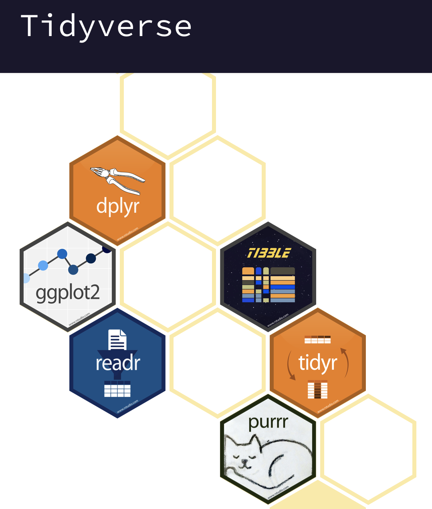</center>
]

---
#### Topic 5: Data and Data Wrangling
Exploring and Summarizing Data in R

<center>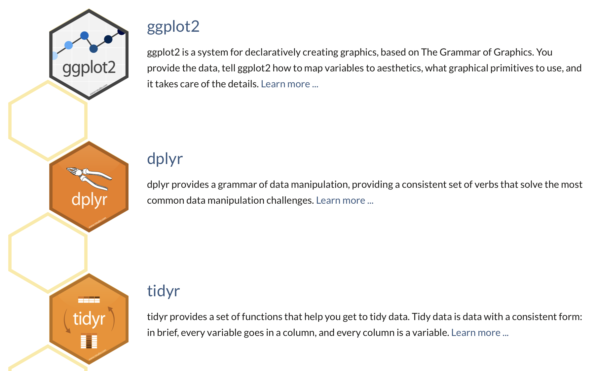</center>

---
#### Topic 5: Data and Data Wrangling
Exploring and Summarizing Data in R

<center>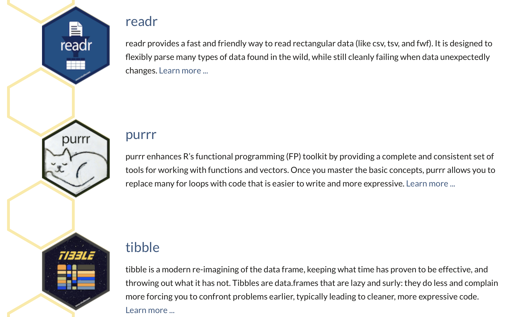</center>

---
#### Topic 5: Data and Data Wrangling
Exploring and Summarizing Data in R

 * Working with the pipe operator (%>%) - **magrittr**
 
--
 
  + This operator forwards an object, into the next function.
  
--
  
  + Perform multiple functions, without nesting, or looping.

---
#### Topic 5: Data and Data Wrangling
Exploring and Summarizing Data in R  
  
 * For example, in our *mpg* dataset, let's say we're interested in the average highway mpg in cars in 2008, based on their number of cylinders.

--
 
  + Nesting approach:
  
.pull-left[
```{r comment=NA, echo=FALSE, message=FALSE}
library(dplyr)
library(ggplot2)
```

```{r comment=NA, message=FALSE, eval=FALSE}
arrange(
   summarize(
       group_by(
        filter(df,year==2008),
        cyl
          ),
       Avg = mean(hwy)
      ),
   desc(Avg)
 )
```
]

.pull-right[
```{r comment=NA, message=FALSE, echo=FALSE}
arrange(
   summarize(
       group_by(
        filter(df,year==2008),
        cyl
          ),
       Avg = mean(hwy)
      ),
   desc(Avg)
 )
```
]

---
#### Topic 5: Data and Data Wrangling
Exploring and Summarizing Data in R  
  
 * For example, in our *mpg* dataset, let's say we're interested in the average highway mpg in cars in 2008, based on their number of cylinders.
 
  + Multiple objects approach:
  
.pull-left[
```{r comment=NA, echo=FALSE, message=FALSE}
library(dplyr)
library(ggplot2)
```

```{r comment=NA, message=FALSE, eval=FALSE}
a <- filter(df, year==2008)
b <- group_by(a, cyl)
c <- summarize(b,
               Avg=mean(hwy)))
d <- arrange(c, desc(Avg))
print(d)
```
]

.pull-right[
```{r comment=NA, message=FALSE, echo=FALSE}
a <- filter(df, year==2008)
b <- group_by(a, cyl)
c <- summarize(b, Avg=mean(hwy))
d <- arrange(c, desc(Avg))
print(d)
```
]

---
#### Topic 5: Data and Data Wrangling
Exploring and Summarizing Data in R  
  
 * For example, in our *mpg* dataset, let's say we're interested in the average highway mpg in cars in 2008, based on their number of cylinders.
 
  + Piping approach:
  
.pull-left[
```{r comment=NA, echo=FALSE, message=FALSE}
library(dplyr)
library(ggplot2)
```

```{r comment=NA, message=FALSE, eval=FALSE}
df %>%
   filter(year==2008) %>%
   group_by(cyl) %>%
   summarize(Avg=mean(hwy)) %>%
   arrange(desc(Avg))
```
]

.pull-right[
```{r comment=NA, message=FALSE, echo=FALSE}
df %>%
   filter(year==2008) %>%
   group_by(cyl) %>%
   summarize(Avg=mean(hwy)) %>%
   arrange(desc(Avg))
```
]

---
#### Topic 5: Data and Data Wrangling
Exploring and Summarizing Data in R

 * Helpful functions - **dplyr**
 
  + *filter()* picks cases based on their values.
  
  + *select()* picks variables based on their names.
  
  + *arrange()* changes the ordering of rows.
  
  + *group_by()* allows operations by groups.
  
  + *mutate()* adds new variables to a dataset.
  
  + *summarise()* reduces multiple values down to a summary value.
  
---
class: inverse

#### Exercise - Summarizing Data:
 * The *mpg* dataset provides data on fuel efficiency for a variety of vehicles in 1999 and 2008.

--

 * Using that data and the piping method:
  1. What manufacturer had the highest highway mpg in 1999? Was it the same one in 2008?
  
  2. Based on number of cylinders, calculate the average highway and city mpg, in both 1999 and 2008, as well as the difference bewteen highway and city mpg.
    
--

 * How did you do?
 
---
#### Exercise - Summarizing Data:

 * What manufacturer had the highest highway mpg in 1999? Was it the same one in 2008?

--

```{r comment=NA}
df %>% filter(year==1999) %>% 
   arrange(desc(hwy)) %>% 
   head(1)

df %>% filter(year==2008) %>% 
   arrange(desc(hwy)) %>% 
   head(1)
```


---
#### Exercise - Summarizing Data:

 * Based on number of cylinders, calculate the average highway and city mpg, in both 1999 and 2008, as well as the difference bewteen highway and city mpg.

--

```{r comment=NA}
df %>%
   group_by(cyl,year) %>%
   summarize(Avg_hwy=mean(hwy, na.rm=TRUE),
             Avg_cty=mean(cty, na.rm=TRUE)) %>%
   mutate(Diff=Avg_hwy-Avg_cty)
```


---
class: inverse

#### Review - Data and Data Wrangling:
* Working directories and data can be loaded both programmatically and using the RStudio interface.

* R reads data within brackets as row x column.

* Pay attendtion to function arguments - missing values can cause problems.

* Tidyverse packages provide a programming grammar that simplifies applying multiple functions.


---
class: center, middle, inverse

#### Topic 6: Plotting
<br/><br/>
<br/><br/>
<br/><br/>
<br/><br/>
<br/><br/>
<br/><br/>
---
#### Topic 6: Plotting

Visualizing data in R

<center><b>“The simple graph has brought more information to the data analyst’s mind than any other device.” - John Tukey</b></center>

--

<center>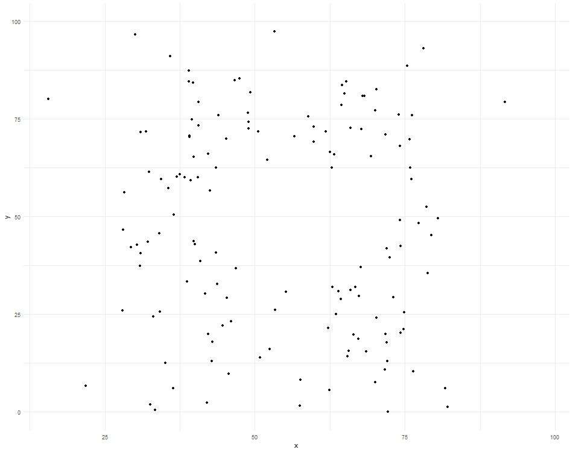</center>

---
#### Topic 6: Plotting

Visualizing data in R

 * Let's explore visualizing data in R, using **ggplot2** - another Tidyverse package.

--

 * Basic steps:
  
   1. Set working directory.
   
   2. Load data.
   
   3. Explore data!
   
---
#### Topic 6: Plotting

Visualizing data in R

 * Let's explore visualizing data in R, using **ggplot2** - a Tidyverse package.

 * Basic steps:
  
   1. Set working directory.
   
   2. Load data.
   
   3. ~~Explore data!~~ Visualize data!
 
---
#### Topic 6: Plotting

Visualizing data in R

 * Before start plotting, let's get to know **ggplot2**.
 
--
 
 * Follows a basic template:
  
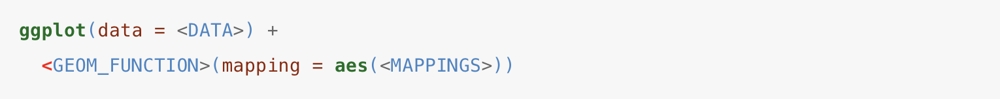

--

 * *ggplot()* function - creates a "blank canvas". The first argument is your dataset.
 
--

 * *geom()* function - adds a layer. For example, *geom_point* creates a scatterplot. 
  + There are many geom functions!

---
#### Topic 6: Plotting

Visualizing data in R

 * Let's try the first function by itself. What happened?
```{r comment=NA, echo=FALSE}
  library(ggplot2)
```

```{r comment=NA, eval=FALSE}
 ggplot(data=df)
```

---
#### Topic 6: Plotting

Visualizing data in R

<center></center>
 
---
#### Topic 6: Plotting

Visualizing data in R

 * Let's try the first function by itself. What happened?
```{r comment=NA, eval=FALSE}
 ggplot(data=df)
```

 * Now lets add some layers, with the second function.
```{r comment=NA, eval=FALSE}
 ggplot(data=df) +
 geom_point(mapping=aes(x=displ,y=hwy))
```

---
#### Topic 6: Plotting

Visualizing data in R

<center>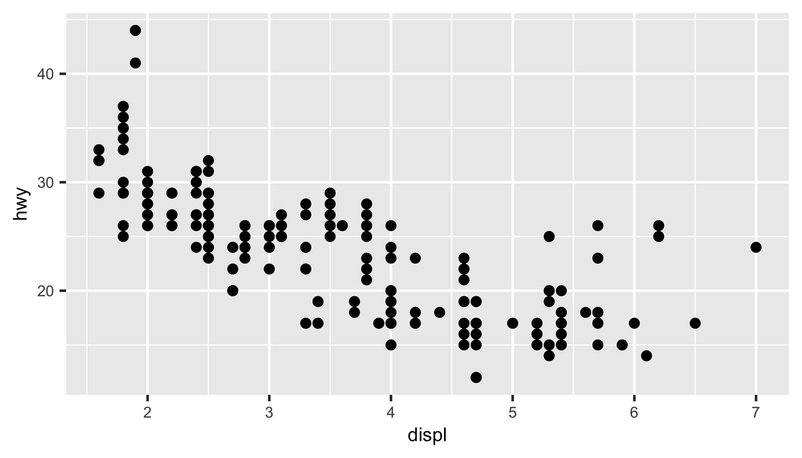</center>

---
#### Topic 6: Plotting

Visualizing data in R

 * Let's try the first function by itself. What happened?
```{r comment=NA, eval=FALSE}
 ggplot(data=df)
```

 * Now lets add some layers, with the second function.
```{r comment=NA, eval=FALSE}
 ggplot(data=df) +
 geom_point(mapping=aes(x=displ,y=hwy))
```

 * Now lets add an additional **aesthetic**.
```{r comment=NA, eval=FALSE}
 ggplot(data=df) +
 geom_point(mapping=aes(x=displ, y=hwy, color=class))
```

---
#### Topic 6: Plotting

Visualizing data in R

<center>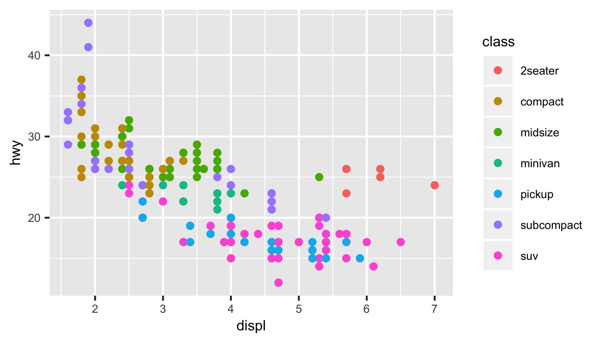</center>

---
#### Topic 6: Plotting

Visualizing data in R

 * We can also add additional layers [geoms](<https://rstudio.com/wp-content/uploads/2015/03/ggplot2-cheatsheet.pdf>).
```{r comment=NA, eval=FALSE}
 ggplot(data=df) +
 geom_point(mapping=aes(x=displ, y=hwy, color=class)) +
 geom_smooth(mapping=aes(x=displ, y=hwy), method="lm")
```

---
#### Topic 6: Plotting

Visualizing data in R

<center>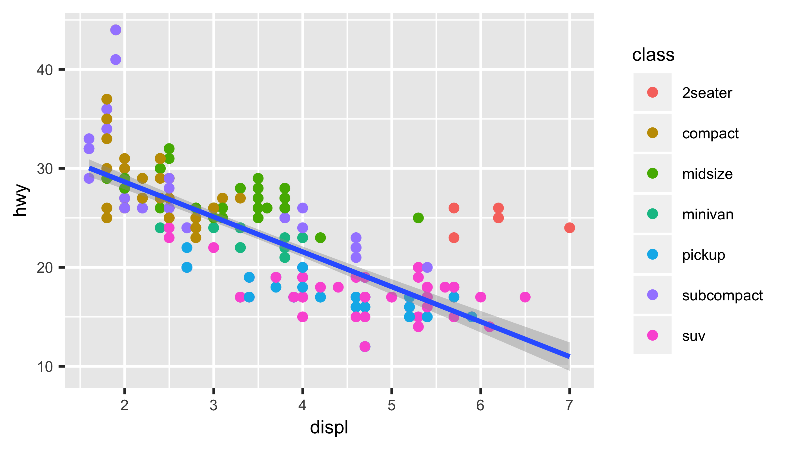</center>

---
#### Topic 6: Plotting

Visualizing data in R

 * We can also add additional layers [geoms](<https://rstudio.com/wp-content/uploads/2015/03/ggplot2-cheatsheet.pdf>).
```{r comment=NA, eval=FALSE}
 ggplot(data=df) +
 geom_point(mapping=aes(x=displ, y=hwy, color=class)) +
 geom_smooth(mapping=aes(x=displ, y=hwy), method="lm")
```

---
#### Topic 6: Plotting

Visualizing data in R

 * Now, let's clean the plot up a bit.
```{r comment=NA, eval=FALSE}
 ggplot(mpg, aes(x=displ, y=hwy)) +
  theme(plot.background=element_blank(),
        panel.border=element_blank(),
        axis.ticks=element_line(size=0.25),
        axis.text=element_text(size = 7),
        axis.line=element_line(size=0.25),
        axis.title=element_text(size = 7),
        legend.text=element_text(size = 7),
        legend.title=element_text(size = 7),
        legend.key=element_blank(),
        plot.title=element_text(hjust=.5, size=8)) +
    geom_point(aes(color=class),size=0.25) +
    geom_smooth(method="lm", size=0.25) +
    labs(title="Highway mileage by engine displacement",
         x="Engine displacement (L)",
         y="Highway miles per gallon",
         color="Vehicle class")
```

---
#### Topic 6: Plotting

Visualizing data in R

<center>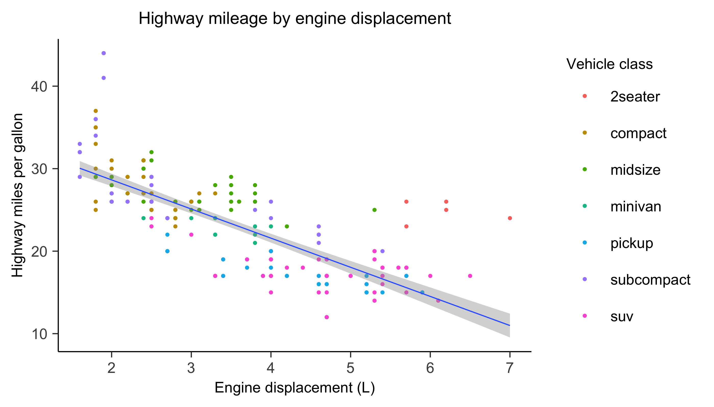</center>

---
#### Topic 6: Plotting

Visualizing data in R

<center></center>

---
class: inverse

#### Review - Plotting:
* Data can look quantitatively the same, but qualitatively different.

* **ggplot2** package in R uses a multi-function approach to plotting.

* More on visualizing data in a few weeks...

---
class: center, middle, inverse

#### Topic 7: Other things to do with R
<br/><br/>
<br/><br/>
<br/><br/>
<br/><br/>
<br/><br/>
<br/><br/>
---

#### Topic 7: Other things to do with R

* [R Markdown documents](<https://rmarkdown.rstudio.com>)

* [Shiny Apps](<https://shiny.cc.lehigh.edu/jsm4/climate/>)