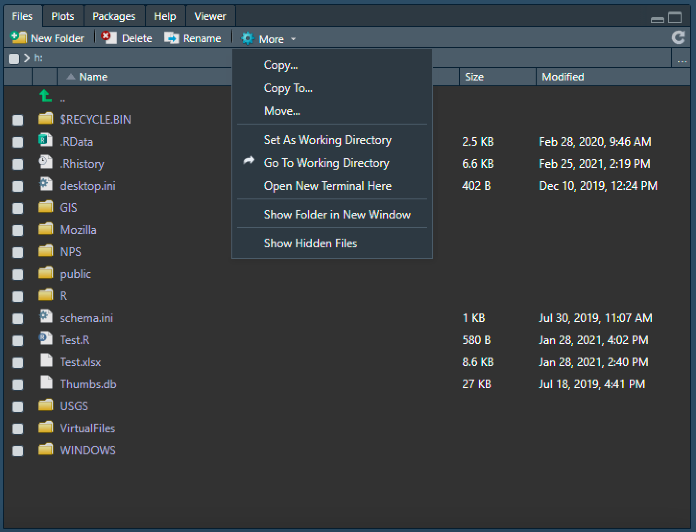

class: center, middle, inverse, title-slide
<style>
  pre {
    background-color: lightyellow;
    white-space: pre-wrap;
    line-height: 100%;
  }
</style>

```{r xaringan-panelset, echo = FALSE}
xaringanExtra::use_panelset()
```

```{r xaringan-tile-view, echo=FALSE}
xaringanExtra::use_tile_view()
```

```{r echo=FALSE}
xaringanExtra::style_panelset_tabs(
  active_foreground = "#0051BA",
  hover_foreground = "#d22",
  font_family = "Roboto"
)
```

## Programming in R: a brief introduction
#### Jeremy Mack
#### Lehigh University - Digital Scholarship Team


---
class: center, middle, inverse, title-slide

## Programming in R: a brief introduction
#### Jeremy Mack
#### Lehigh University - Digital Scholarship Team
 &nbsp;  &nbsp; 
<br/><br/>
<br/><br/>
<br/>

---
### About this presentation

 * This course is a **brief introduction** into R.

--
 
 * It is targeted at people that have little to no experience
   progamming.

--
   
 * It could be useful for people who learned R some time ago and
   forgot it, or who are not familiar with modern R programming
   (`tidyverse`).

--

 * It focuses on a bit of history, an introduction to the R 
   environment, and some hands experience with **data wrangling**.

--

* Slides are available on [Lehigh's Research Computing site](https://confluence.cc.lehigh.edu/display/hpc/Seminars) and Github ([slides](https://jeremymack-lu.github.io/rprog/) and [raw code](https://github.com/jeremymack-LU/rprog))
   
---

### Structure of the presentation

The presentation is split into seven topics:

 * [**Topic 1:**](<https://jeremymack-lu.github.io/rprog/#10>) What is R? Why use it?
 
 * [**Topic 2:**](<https://jeremymack-lu.github.io/rprog/#24>) What is RStudio? Why use it?
 
 * [**Topic 3:**](<https://jeremymack-lu.github.io/rprog/#36>) Getting started with R and RStudio
 
 * [**Topic 4:**](<https://jeremymack-lu.github.io/rprog/#61>) Objects and Functions
 
 * [**Topic 5:**](<https://jeremymack-lu.github.io/rprog/#113>) Data and Data Wrangling
 
 * [**Topic 6:**](<https://jeremymack-lu.github.io/rprog/#167>) Tidyverse
 
 * [**Topic 7:**](<https://jeremymack-lu.github.io/rprog/#200>) Extras - RStudio projects, Other things to do in R, and Resources

---
#### Programming in R

[<center></center>](https://github.com/allisonhorst/stats-illustrations)

---
class: center, middle, inverse

#### Topic 1: What is R? Why use it?
<br/><br/>
<br/><br/>
<br/><br/>
<br/><br/>
<br/><br/>
<br/><br/>
---

#### Topic 1: What is R? Why use it?

.pull-left[
<center></center>
]

.pull-right[
- R is a **programming language** ([one of many](<https://www.tiobe.com/tiobe-index/>)) and an **environment** for statistical computing.
{{content}}
]

--

- Developed by Ross Ihaka and Robert Gentleman `r lubridate::year(Sys.Date())-1993` years ago; now maintained by a core team supported by the R Foundation.
{{content}}

--

- Dialect of the S language (S-Plus)
{{content}}
   
---

#### Topic 1: What is R? Why use it?

.pull-left[
<center></center>
]

.pull-right[
- R is a **programming language** ([one of many](<https://www.tiobe.com/tiobe-index/>)) and an **environment** for statistical computing.
   
- Developed by Ross Ihaka and Robert Gentleman `r lubridate::year(Sys.Date())-1993` years ago; now maintained by a core team supported by the R Foundation.

- Dialect of the S language (S-Plus)
]


---

#### Topic 1: What is R? Why use it?

.pull-left[
<center></center>
]

.pull-right[
- **Free!**
{{content}}
]

--

- Rich data analysis and visualization options
{{content}}

--

- Available on most platforms/OS
{{content}}
--

- **Very active development community**
    + CRAN: The Comprehensive R Archive Network
    + User contributed packages <br/> (> 18,000)
    {{content}}

--

- **Reproducibility**

---
#### Topic 1: What is R? Why use it?

 
##### - 2019 report by The National Academies of Sciences, Engineering, and Medicine

---
#### Topic 1: What is R? Why use it?

 &nbsp; &nbsp; &nbsp; 
##### - 2018 series featured in Nature

--

######  - "There's nothing more reproducible than code. And unfortunately, there are few things LESS reproducible than pointing and clicking, then trying to tell someone how you did it."

--

######  - "If you want to do ONE THING to make your work more reproducible as a scientist, don't be daunted, but the thing you should do is learn how to code."

---
class: center, middle, inverse

#### Topic 2: What is RStudio? Why use it?
<br/><br/>
<br/><br/>
<br/><br/>
<br/><br/>
<br/><br/>
<br/><br/>
---

#### Topic 2: What is RStudio? Why use it?

.pull-left[

]

.pull-right[
* RStudio is a **company** that develops **free and open tools** for R, and enterprise-ready professional products.
{{content}}
]

--

* **Integrated Development Environment** (IDE), or a front end platform
to run R.
{{content}}

---

#### Topic 2: What is RStudio? Why use it?

.pull-left[

]

.pull-right[
* RStudio is a **company** that develops **free and open tools** for R, and enterprise-ready professional products.

* **Integrated Development Environment** (IDE), or a front end platform
to run R.
]


---

#### Topic 2: What is RStudio? Why use it?

.pull-left[

]

.pull-right[
* Like R, it's **free**!
{{content}}
]

--

* It can reduce the learning curve of R, by creating **organization**.
{{content}}

--

* Integrates nicely with other R features/applications:
    + Projects
    + Version control
    + R Markdown
    + ShinyApps

---

#### Topic 2: What is RStudio? Why use it?

How do R and RStudio work together? Consider a car analogy.

--

.pull-left[
**RStudio - the body**
 - RStudio provides a frame that keeps things organized and finishings that make it visualling appealing.

**R - the engine**
 - R runs things under the hood - it's the enginge that allows the car to drive.
]

.pull-right[

]

---
class: inverse

#### Review - R and RStudio:

* **R** is a programming language built for statistical computing ("Engine").

 + It's open source and it's free.

* **RStudio** is an integrated development envrionment that makes working with R easier ("Body").

 + It's developed by a company, but it's also free.

---
class: center, middle, inverse

#### Topic 3: Getting started with R and RStudio
<br/><br/>
<br/><br/>
<br/><br/>
<br/><br/>
<br/><br/>
<br/><br/>
---

#### Topic 3: Getting started with R and RStudio

How do I get R and RStudio?

--

* Download and local install:

 + You can download R on its own through the [R Project website](https://www.r-project.org).
   
 + You can download RStudio, including R,
   at the [RStudio website](https://rstudio.com/products/rstudio/download/).
   
--

* R and RStudio at Lehigh:

 + Both R and RStudio are available on [LUapps](https://luapps.lehigh.edu).
 
 + LUapps can be accessed both on campus and off-campus (over VPN).
 
<center></center>

---

#### Topic 3: Getting started with R and RStudio

First, let's explore RStudio.

[](https://luapps.lehigh.edu)

---

#### Topic 3: Getting started with R and RStudio

First, let's explore RStudio.


---

#### Topic 3: Getting started with R and RStudio
<style>
  pre {
    background-color: lightyellow;
    white-space: pre-wrap;
    line-height: 100%;
  }
</style>

Next, let's explore R - the engine under the hood.

In true computer science fashion, let's first try typing:

.tiny[
```{r eval=FALSE}
print("Hello world!")
```
]

What happend?

--

.tiny[
```{r echo=FALSE, comment=NA}
print("Hello world!")
```
]

---

#### Topic 3: Getting started with R and RStudio

Two things to note:

- We didn't just get "Hello world!", we also got `[1]`. This is R's way
of printing to the screen; it's telling us the position we're at.

- We didn't need to put anything at the end of the line, we just hit return.

---

#### Topic 3: Getting started with R and RStudio

Now, let's try three things...

Try capitalizing `Print(...)`:
 
.tiny[
```{r eval=FALSE}
Print("Hello world!")
```
]

Try putting a space between `print` and `("Hello world!")`:

.tiny[
```{r eval=FALSE}
print ("Hello world!")
```
]

Try just entering `"Hello world!"`:

.tiny[
```{r eval=FALSE}
"Hello world!"
```
]

What happened?

--
 
.tiny[
```{r echo=FALSE, error=TRUE, comment=NA}
Print("Hello world!")
```

```{r echo=FALSE, comment=NA}
print ("Hello world!")
```

```{r echo=FALSE, comment=NA}
"Hello world!"
```
]

---

#### Topic 3: Getting started with R and RStudio

Three things you just learned:

 - R is **case-sensitive**.
 
 - R does not care about **whitespace**.
 
 - R will **print** results by default.

---

#### Topic 3: Getting started with R and RStudio

You can also use R as a calculator. Let's try the following:

.tiny[
```{r eval=FALSE}
2 + 2
```
]
--
.tiny[
```{r echo=FALSE, comment=NA}
2 + 2
```
]
--
.tiny[
```{r eval=FALSE}
4 * 2
```
]
--
.tiny[
```{r echo=FALSE, comment=NA}
4 * 2
```
]
--
.tiny[
```{r eval=FALSE}
8 / 3
```
]
--
.tiny[
```{r echo=FALSE, comment=NA}
8 / 3
```
]
--
.tiny[
```{r eval=FALSE}
exp(log(8)-log(3))
```
]
--
.tiny[
```{r echo=FALSE, comment=NA}
exp(log(8)-log(3))
```
]

---
#### Topic 3: Getting started with R and RStudio
#### Assignments

We often want to save the results of our calculations, rather than print them to the screen. To do so, 
we'll use the **assignment operator**, `<-`

Here's an example:

.tiny[
```{r}
x <- log(8)
y <- log(3)
```
]

--
Now we can redo our last calculation using the assignments:

.tiny[
```{r comment=NA}
exp(x-y)
```
]

 *Shortcut in RStudio: Option + - (Mac OS), Alt + - (Windows OS)

---
#### Topic 3: Getting started with R and RStudio
#### Concatenation

We will often want to work on sequences of values, rather than specific values. 

To do so, we'll use the **concatenation operator**, `c(...)`

Here's an example:

.tiny[
```{r}
n <- c(2, 3, 5, 8, 13, 21, 34, 55)
```
]

--

We can now apply opertions across the entire vector.

For example:

.tiny[
```{r comment=NA}
n * 2
```
]

---
#### Topic 3: Getting started with R and RStudio
#### Logicals

It can be useful to know whether our values meet certain conditions. 

In addition to **character values** (which we saw when we called `print("Hello world!")`), R also allows **logical values**, or `TRUE` and `FALSE`.

For example, we can check which numbers in our "n" vector are double digit:

.tiny[
```{r comment=NA}
n
is_double_digit <- n > 9
is_double_digit
```
]

---
class: inverse

#### Review - Getting started with R and RStudio:
* RStudio has four main windows to keep things **organized**.

* R is **case-sensitive**.

* R is a calculator.

* R can be used to store objects (**assignments**) that can be used with other functions, or compared to other objects.

---
class: center, middle, inverse

#### Topic 4: Objects and Functions
<br/><br/>
<br/><br/>
<br/><br/>
<br/><br/>
<br/><br/>
<br/><br/>

---
#### Topic 4: Objects and Functions

R largely revolves around two things: **objects** and **functions**.

<center><b>Define objects > Apply functions > Repeat!</b></center>

--

For example, we can define a simple object called "n":

.tiny[
```{r}
n <- c(2, 3, 5, 8, 13, 21, 34, 55)
```
]

--

We can then apply a function to our object. Lets say we're interested in the average, so we'll apply the mean function:

.tiny[
```{r comment=NA}
avg.n <- mean(n)
avg.n
```
]

---
#### Topic 4: Objects and Functions

Objects in R:
* Objects come in many different shapes and sizes - like a number, a dataset, or the results of a statistical test.

--

* Objects are essentially *data* that have a particular **type** and **structure**.

--

* There are five basic **types** (classes) of data in R:
 1. Logical
 2. Double
 3. Integer
 4. Complex
 5. Character
 {{content}}
--
 6. Factors - special case of Integer with Character labels
 {{content}}
 
---
#### Topic 4: Objects and Functions

Objects in R - data types:
* Logical - created via comparison(s).

.tiny[
```{r, comment=NA}
x <- 1; y <- 2          # Create sample values x and y
z <- x > y              # Is x larger than y? 
z                       # Print the logical value 
```
]

--

.tiny[
```{r, comment=NA}
typeof(z)               # Print the data type of z
```
]
 
---
#### Topic 4: Objects and Functions

Objects in R - data types:
* Double - a number, often approximated; default data type in R
 
.tiny[
```{r comment=NA}
x <- 10.5               # Define object x
x                       # Print x
```
]

--

.tiny[
```{r comment=NA}
typeof(x)               # Print the data type of x
```
]

---
#### Topic 4: Objects and Functions

Objects in R - data types:
* Integer - whole numbers; a number that is not a fraction

.tiny[
```{r comment=NA}
x <- 10                 # Define object x
x                       # Print x
```
]

--

.tiny[
```{r comment=NA}
typeof(x)               # Print the data type of x
```
]

---
#### Topic 4: Objects and Functions

Objects in R - data types:
* Integer - whole numbers; a number that is not a fraction

.tiny[
```{r comment=NA}
x <- as.integer(10)     # Declare as integer
x                       # Print x
```
]

--

.tiny[
```{r comment=NA}
typeof(x)               # Print the data type of x
```
]

--

.tiny[
```{r comment=NA}
x <- 10L                # Declare as integer by appending with "L"
x                       # Print x
typeof(x)               # Print the data type of x
```
]

---
#### Topic 4: Objects and Functions

Objects in R - data types:
* Complex - any number that can be written as a + bi, where *i* is the imaginary unit and a and b
are real numbers.

.tiny[
```{r, comment=NA}
x <- 1 + 2i             # Create a complex number x
x                       # Print the value of x 
```
]

--

.tiny[
```{r, comment=NA}
typeof(x)               # Print the data type of x
```
]

---
#### Topic 4: Objects and Functions

Objects in R - data types:
* Character - used to represent string values in R.

.tiny[
```{r, comment=NA}
x <- as.character(3.14) # Declare as character
x                       # Print the character string 
```
]

--

.tiny[
```{r, comment=NA}
typeof(x)               # Print the data type of x
```
]

--

.tiny[
```{r comment=NA}
x <- "3.14"             # Declare as character with " "
x                       # Print x
typeof(x)               # Print the data type of x
```
]

---
#### Topic 4: Objects and Functions

Objects in R - data types:
* Factor - fixed set of possible values (categorical variables); stored as integers

.tiny[
```{r, comment=NA}
x <- c("A","B","C","D") # Create a vector of factor levels
x <- as.factor(x)       # Declare as factor
x                       # Print the value of x 
```
]

--

.tiny[
```{r, comment=NA}
typeof(x)               # Print the data type of x
```
]

--

.tiny[
```{r, comment=NA}
str(x)                  # Print the structure of x
```
]

---
#### Topic 4: Objects and Functions

Objects in R:
* Objects come in many different shapes and sizes - like a number, a dataset, or the results of a statistical test.

* Objects are essentially *data* that have a particular **type** and **structure**.

* There are five basic **types** (classes) in R:
 1. Logical
 2. Double
 3. Integer
 4. Complex
 5. Character
 6. Factors - special case of Integer with Character labels

---
#### Topic 4: Objects and Functions

Objects in R:
* Objects come in many different shapes and sizes - like a number, a dataset, or the results of a statistical test.

* Objects are essentially *data* that have a particular **type** and **structure**.

* There are four basic **structures** in R:
 1. Scalar
 2. Vector
 3. Matrix
 4. Data frames (and Tibbles)
 
---
#### Topic 4: Objects and Functions

Objects in R - data structure:

.pull-left[

]

.pull-right[
There are four types of data structures:
* Scalar
   
* Vector

* Matrix

* Data frame (and Tibbles)
]

---
#### Topic 4: Objects and Functions

Objects in R - data structure:

.pull-left[

]

.pull-right[
**Scalar objects:**
1. Hold only one value at a time.
 
2. Can be used to build more complex objects.

]

---
#### Topic 4: Objects and Functions

Objects in R - data structure:

.pull-left[

]

.tiny6.pull-right[
**Scalar objects:**
```{r comment=NA}
x <- 10.5 
x
str(x)
```

]

---
#### Topic 4: Objects and Functions

Objects in R - data structure:

.pull-left[

]

.pull-right[
**Vector objects:**
1. Hold several values stored as a single object.
 
2. Two main types:
* **Atomic vectors** can be either numeric or character (not both!).

* **Recursive vectors**, or lists, can contain both numeric and character data.

]

---
#### Topic 4: Objects and Functions

Objects in R - data structure:

.pull-left[

]

.tiny6.pull-right[
**Vector objects:**
```{r comment=NA}
n <- c(2,3,5,8,13,21,34,55) 
n
str(n)
```

]

---
#### Topic 4: Objects and Functions

Objects in R - data structure:

.pull-left[

]

.tiny6.pull-right[
**Vector objects:**
```{r comment=NA}
n <- c(2,3,5,8,13,21,34,"55") 
n
str(n)
```

]

---
#### Topic 4: Objects and Functions

Objects in R - data structure:

.pull-left[

]

.tiny6.pull-right[
**Vector objects:**
```{r comment=NA}
x <- list(a=1, b=c(2,3), c="list")
x
str(x)
```

]

---
#### Topic 4: Objects and Functions

Objects in R - data structure:

.pull-left[

]

.tiny6.pull-right[
**Vector objects:**
```{r comment=NA}
x <- list(a=1, b=c(2,"3"), c="list")
x
str(x)
```

]

---
#### Topic 4: Objects and Functions

Objects in R - data structure:

.pull-left[

]

.pull-right[
**Matrix objects:**
1. Large data structures.
 
2. Has 2-dimensions, representing its height (rows) and width (columns).
 
3. Can be either numeric or character (not both!).

] 
---
#### Topic 4: Objects and Functions

Objects in R - data structure:

.pull-left[

]

.tiny6.pull-right[
**Matrix objects:**
```{r comment=NA}
x <- 1:5
y <- 6:10
z <- 11:15
m <- cbind(x,y,z)
class(m)
str(m)
```

] 
---
#### Topic 4: Objects and Functions

Objects in R - data structure:

.pull-left[

]

.pull-right[
**Data frame objects:**
1. Large data structures.
 
2. Has 2-dimensions, representing its height (rows) and width (columns).
 
3. Can be a mix of data types.

] 
---
#### Topic 4: Objects and Functions

Objects in R - data structure:

.pull-left[

]

.tiny6.pull-right[
**Data frame objects:**
```{r, comment=NA}
survey <- data.frame(
"id"  = c(1,2,3,4,5),
"sex" = c("m","m","m","f","f"),
"age" = c(99,46,23,54,23))
class(survey)
str(survey)
```

]

---
#### Topic 4: Objects and Functions

Objects in R - data structure:

.pull-left[

]

.pull-right[
**Tibble objects:**
1. Large data structures.
 
2. Has 2-dimensions, representing its height (rows) and width (columns).
 
3. Can be a mix of data types.
{{content}}
]

--

4. "Lazy data frames"
{{content}}
  * They do less and complain more.

---
#### Topic 4: Objects and Functions

Objects in R - data structure:

.pull-left[

]

.tiny6.pull-right[
**Tibble objects:**
```{r, echo=FALSE}
library(tibble)
```


```{r, comment=NA}
pacman::p_load(tibble)
survey <- tibble(
"id"  = c(1,2,3,4,5),
"sex" = c("m","m","m","f","f"),
"age" = c(99,46,23,54,23))
class(survey)
str(survey)
```

]

---
#### Topic 4: Objects and Functions

Objects in R - data structure:

<center></center>

---
class: inverse

#### Review - Objects:
* Define objects > Apply functions > Repeat!

* Objects are data that have a type and structure. 

* There are five basic types of data:
   1. Logical
   2. Double - default data type in R
   3. Integer
   4. Complex
   5. Character
   6. Factors - special case of Integer with Character labels

* There are four basic structures:
   1. Scalar
   2. Vector
   3. Matrix
   4. Data frames (and Tibbles)

---
#### Topic 4: Objects and Functions

R largely revolves around two things: **objects** and **functions**.

<center><b>Define objects > Apply functions > Repeat!</b></center>

---
#### Topic 4: Objects and Functions

Functions in R:

* Functions are procedures that typically take one or more objects as **arguments** (i.e., inputs), does something with them, then returns a new object (i.e., result).

--

* Functions vary in complexity - like computing a mean, to a statistical test.

--

* How do we get functions loaded into R?

--

 1. Write your own.

.tiny6[
```{r, comment=NA}
ages <- c(99,46,23,54,23)
```
]
 .tiny6[
```{r, comment=NA}
age_mean <- function(x) {
  summation <- sum(x)
  summation / length(x)
}
age_mean(ages)
```
]

---
#### Topic 4: Objects and Functions

Functions in R:

* Functions are procedures that typically take one or more objects as **arguments** (i.e., inputs), does something with them, then returns a new object (i.e., result).

* Functions vary in complexity - like computing a mean, to a statistical test.

* How do we get functions loaded into R?
 1. Write your own.

 2. Community development (**Packages**)!

---
#### Topic 4: Objects and Functions

Packages in R:

* R packages are used to install pre-built functions into the R Environment.

--

* In addition to functions, packages also include data sets, help documentation, and how-to examples (i.e., vignette).

--

* When install R for the first time, you are installing the [base R](<https://stat.ethz.ch/R-manual/R-devel/library/base/html/00Index.html>), which includes only functions written by the original authors of the R language.

--

* Additional packages are developed by the [R community](<https://cran.case.edu>).

--

* How de we get ~~functions~~ packages loaded into R?

---
#### Topic 4: Objects and Functions

How do we get packages loaded into R?

* Two step process:
 1. Install the package - do this once
 
 2. Load the package into R - do this every time

.panelset[

.panel[.panel-name[Programmatically]

.tiny6[
```{r, eval=FALSE}
# Traditional methods
install.packages("ggplot2")    # Quotes are necessary
install.packages("dplyr")
library("ggplot2")             # Quotes are optional
library(dplyr)

# More efficient way
install.packages("pacman")     # Install pacman package
pacman::p_load(ggplot2, dplyr) # Use p_load function
```
]

.panel[.panel-name[R Studio IDE]

<center></center>

]]]

---
class: inverse

#### Review - Functions (and Packages):
* Define objects > Apply functions > Repeat!

* Functions are used to work with objects in R and are loaded via packages.

* Standard functions are a part of **base R**, which loads automatically when R is opened.

* There is also a **large community** of users that develop packages for R (18,300+ and counting!).

* Packages can be loaded both programmatically and with the RStudio explorer window.

* Two step process:
  1. Install package
  
  2. Load package into library
---
class: center, middle, inverse

#### Topic 5: Data and Data Wrangling
<br/><br/>
<br/><br/>
<br/><br/>
<br/><br/>
<br/><br/>
<br/><br/>

---
#### Topic 5: Data and Data Wrangling

<center></center>

---
#### Topic 5: Data and Data Wrangling

<center></center>

---
#### Topic 5: Data and Data Wrangling

Basic steps to working with data in R:

 * Check and/or set a working directory.

 * Load data.
 
 * Wrangle data (Explore, Summarize, and Analyze)!

---
#### Topic 5: Data and Data Wrangling

Basic steps to working with data in R:

 * Check and/or set a working directory.

.panelset[

.panel[.panel-name[Programmatically]

.tiny6[
```{r, eval=FALSE}
getwd()         # Prints current working directory
```

```
[1] "h:/"
```
]


.tiny6[
```{r, comment=NA, eval=FALSE}
setwd("h:/Lehigh")   # Sets path to working directory
getwd()         # Prints current working directory
```

```
[1] "h:/Lehigh"
```
]
]

.panel[.panel-name[RStudio IDE]

<center></center>

]
]

---
#### Topic 5: Data and Data Wrangling

Basic steps to working with data in R:

 * Check and/or set a working directory.

 * Load data.

---
#### Topic 5: Data and Data Wrangling

Basic steps to working with data in R:

 * Check and/or set a working directory.

 * Load data.

.panelset[

.panel[.panel-name[Programmatically]

.tiny6[
```{r, comment=NA, eval=FALSE}
# base package options (reads to a data frame)
read.table()  # Reads tabular data
read.csv()    # Reads comma separated files
read.delim()  # Reads tab separated files

# readr package options (reads to a tibble)
read_table()  # Reads tabular data
read_csv()    # Reads comma separated files
read_delim()  # Reads tab separated files

# readxl package options (reads to a tibble)
read_xlsx()   # Reads .xlsx files
read_xls()    # Reads .xls files
```
]

.panel[.panel-name[R Studio IDE]

 

]]]

---
#### Topic 5: Data and Data Wrangling

Basic steps to working with data in R:

 * Check and/or set a working directory.

 * Load data.
 
 * Wrangle data (Explore, Summarize, and Analyze)!

<center></center>

---
#### Topic 5: Data and Data Wrangling

Exploring data in R:

 * Let's use a dataset from the web to practice saving and loading data.
 
.tiny6[
```{r, echo=FALSE}
library(readr)
```

```{r, comment=NA, eval=FALSE}
# Set url link for data download
url <- "https://raw.githubusercontent.com/jeremymack-LU/rprog/master/mpg.csv"

# Download file to working directory
download.file(url, "data/mpg.csv")

# Read data into R
mpg <- read.csv("data/mpg.csv")
```

```{r, comment=NA, echo=FALSE}
mpg <- read.csv("mpg.csv")
```

]

---
#### Topic 5: Data and Data Wrangling

Exploring data in R
 
 * Helpful functions for exploring data in R:
 
.tiny6[
```{r comment=NA, eval=FALSE}
View(x)      # View the dataset in a spreadsheet

str(x)       # Print the structure of the data frame
  
head(x)      # Print the first few rows
  
tail(x)      # Print the last few rows
  
nrow(x)      # Print the number of rows
  
ncol(x)      # Print the number of columns
  
dim(x)       # Print the dimensions (rows x columns)
  
rownames(x)  # Print row names
  
colnames(x)  # Print column names
```
]

---
#### Topic 5: Data and Data Wrangling

Exploring data in R

.tiny6[  * Let's check to make sure our data loaded correctly:
```{r, comment=NA}
head(mpg, 10)
```
]

---
#### Topic 5: Data and Data Wrangling

Exploring data in R

.tiny6[ * Next, we'll check our data structure:
```{r, comment=NA}
str(mpg)
```
]

---
#### Topic 5: Data and Data Wrangling

Exploring data in R

.tiny6[  * Selecting specific data in R:
  
   + R reads data as row x column, using brackets [r,c]
  
```{r comment=NA}
mpg[1,1]  # Print value in row 1, column 1
mpg[6,10] # Print value in row 6, column 10
```
]

---
#### Topic 5: Data and Data Wrangling

Exploring data in R

.tiny6[  * Selecting specific data in R:
  
   + What if we wanted to print just row 1?
   
```{r comment=NA}
mpg[1,]  # Print the first row 
```
]

---
#### Topic 5: Data and Data Wrangling

Exploring data in R

  * Selecting specific data in R:
  
   + What if we wanted to print just column 1?
   
.tiny6[
```{r comment=NA, eval=FALSE}
mpg[,1]   # Print column 1 by number (as a vector)
```
]
.tiny6[   
```{r comment=NA, echo=FALSE}
x <- mpg[,1]
#x <- as.vector(x$manufacturer)
x[1:105]
```
]

---
#### Topic 5: Data and Data Wrangling

Exploring data in R

  * Selecting specific data in R:
  
   + What if we wanted to print just column 1?

.tiny6[
```{r comment=NA, eval=FALSE}
mpg$manufacturer  # Print column 1 by name (as a vector)
```
]

.tiny6[
```{r comment=NA, echo=FALSE}
y <- mpg$manufacturer
y[1:105]
```
]

---
#### Topic 5: Data and Data Wrangling

Exploring data in R

  * Selecting specific data in R:
  
   + What if we wanted to print just column 1?

.tiny6[
```{r comment=NA, eval=FALSE}
mpg[1]  # Print column 1 by name (as a data frame)
```
]

.tiny6[
```{r comment=NA, echo=FALSE}
y <- mpg[1]
head(y,17)
```
]

---
#### Topic 5: Data and Data Wrangling

Basic steps to working with data in R:

 * Check and/or set a working directory.

 * Load data.
 
 * Wrangle data (~~Explore,~~ Summarize, and Analyze)!

<center></center>

---
#### Topic 5: Data and Data Wrangling

Summarizing data in R
 
 * Helpful functions for summarizing data in R:
 
.tiny6[
```{r comment=NA, eval=FALSE}
mean(x)        # Calculate and return the average of the input values

max(x)         # Return the maximum value of the input values
  
min(x)         # Return the minimum value of the input values
  
sd(x)          # Calculate and return the standard deviation of the input values
  
length(x)      # Print the set length of the input values
```
]

---
#### Topic 5: Data and Data Wrangling

Summarizing data in R

 * What if we wanted to summarize the highway mpg data in our dataset?

.tiny6[
```{r comment=NA}
hwy.avg <- mean(mpg$hwy)  # Average value for hwy
hwy.max <- max(mpg$hwy)   # Maximum value for hwy
hwy.min <- min(mpg$hwy)   # Minimum value for hwy
hwy.sd  <- sd(mpg$hwy)    # Standard deviation for hwy
do.call("rbind", list(hwy.avg, hwy.max, hwy.min, hwy.sd))
```

]
 
.tiny6[
```{r comment=NA}
summary(mpg$hwy)  # Average value for hwy
```
]

---
#### Topic 5: Data and Data Wrangling

Summarizing data in R

 * What happens if there are missing data?

.tiny6[
```{r comment=NA}
mpg2 <- mpg
mpg2[1,"hwy"] <- NA
mpg2[1,]
```
]
--
.tiny6[
```{r comment=NA}
mean(mpg2$hwy)  # Average value for mpg
```
]
--
.tiny6[
```{r comment=NA}
# Need to pay attention to additional arguments
mean(mpg2$hwy, na.rm=TRUE)
```
]

---
#### Topic 5: Data and Data Wrangling

Summarizing data in R

 * What if we wanted to add a new variable (i.e., column)?

.tiny6[
```{r comment=NA}
# Let's add a new column of the average mpg
mpg$avg <- (mpg$cty+mpg$hwy)/2
```

```{r comment=NA, echo=FALSE}
mpg[1:5,]
```
]

--

 * Many ways to accomplish the same task:

.tiny6[
```{r comment=NA}
# Let's add a new column with rowMean function
mpg$avg2  <- rowMeans(mpg[,8:9], na.rm=TRUE)
```

```{r comment=NA, echo=FALSE}
mpg[1:5,]
```
]

---
#### Topic 5: Data and Data Wrangling

Basic steps to working with data in R:

 * Check and/or set a working directory.

 * Load data.
 
 * Wrangle data (~~Explore, Summarize,~~ and Analyze)!

<center></center>

---
#### Topic 5: Data and Data Wrangling

Analyzing data in R
 
 * Helpful functions for analyzing data in R:
 
.tiny6[
```{r comment=NA, eval=FALSE}
lm(x)           # Apply a linear model

glm(x)          # Apply a generalized linear model
  
t.test(x)       # Perform a t-test for difference between means
  
aov(x)          # Analysis of variance test
  
prop.test(x)    # Test for a difference between proportions
```
]

---
#### Topic 5: Data and Data Wrangling

Analyzing data in R

 * How does highway mileage change with engine displacement?
 
.tiny6[
```{r comment=NA, eval=FALSE}
# Quick plot of the data
with(mpg, plot(x=displ, y=hwy))
```
]
<center></center>

---
#### Topic 5: Data and Data Wrangling

Analyzing data in R

 * How does highway mileage change with engine displacement?
 
.tiny6[
```{r comment=NA, eval=FALSE}
# Apply a simple linear model
mod <- lm(hwy~displ, data=mpg)
summary(mod)
```
]

.tiny6[
```{r comment=NA, echo=FALSE}
# Apply a simple linear model
mod <- lm(hwy~displ, data=mpg)
summary(mod)
```
]

---
#### Topic 5: Data and Data Wrangling

Analyzing data in R

 * Does highway mileage significantly differ between car classes?
 
.tiny6[
```{r comment=NA, eval=FALSE}
# Quick plot of the data
with(mpg, plot(x=class, y=hwy))
```
]
<center></center>

---
#### Topic 5: Data and Data Wrangling

Analyzing data in R

 * Does highway mileage significantly differ between car classes?
 
.tiny6[
```{r comment=NA, eval=FALSE}
# Apply a simple linear model with an ANOVA test
mod2 <- lm(hwy~class, data=mpg)
aov2 <- aov(mod2)
summary(aov2)
```
]

.tiny6[
```{r comment=NA, echo=FALSE}
# Apply a simple linear model with an ANOVA test
mod2 <- lm(hwy~class, data=mpg)
aov2 <- aov(mod2)
summary(aov2)
```
]

---
class: inverse

#### Exercise - Summarizing Data:
 * The *USArrests* dataset provides data on the number of arrests per 100,000 residents for violent crimes (assault, murder, and rape) in each of the 50 US states in 1973.

--

 * First assign that data to an object called "crime"
.tiny[
```{r comment=NA}
crime <- USArrests
```
]

--

 * Using that data, try the following:
  1. Calculate average number of arrests for assault.
  
  2. Identify maximum number of arrests for assault.
  
  3. Print the statistics for Pennsylvania.
  
  4. Was there a linear relationship between murders and assaults?
  
`r countdown::countdown(minutes = 5, font_size = "48px", bottom=0.5)`

---
class: inverse

#### Exercise - Summarizing Data:
 * The *USArrests* dataset provides data on the number of arrests per 100,000 residents for violent crimes (assault, murder, and rape) in each of the 50 US states in 1973.

 * First assign that data to an object called "crime"
.tiny[
```{r comment=NA}
crime <- USArrests
```
]

 * Using that data, try the following:
  1. Calculate average number of arrests for assault.
  
  2. Identify maximum number of arrests for assault.
  
  3. Print the statistics for Pennsylvania.
  
  4. Was there a linear relationship between murders and assaults?
  
`r countdown::countdown(minutes = 5, font_size = "48px", bottom=0.5)`

 * How did you do?

---
#### Exercise - Summarizing Data:

 * Calculate average number of arrests for assault.

--

.tiny[
```{r, comment=NA}
mean(crime$Assault)
```
]

--

.tiny[
```{r, comment=NA}
mean(crime[,2])
```
]

--

.tiny[
```{r, comment=NA}
sum(crime$Assault)/length(crime$Assault)
```
]

---
#### Exercise - Summarizing Data:

 * Identify maximum number of arrests for assault.

--
 
.tiny[
```{r, comment=NA}
max(crime$Assault)
```
]

--

.tiny[
```{r, comment=NA}
x <- sort(crime$Assault, decreasing=TRUE)
x[1]
```
]

--

.tiny[
```{r, comment=NA}
x <- sort(crime$Assault)
x[50]
```
]

---
#### Exercise - Summarizing Data:

 * Print the statistics for Pennsylvania.

--

.tiny[
```{r, comment=NA}
crime["Pennsylvania",]
```
]

--

.tiny[
```{r, comment=NA}
crime[38,]
```
]

---
#### Exercise - Summarizing Data:

 * Was there a linear relationship between murders and assaults?

--

.tiny[
```{r comment=NA, eval=FALSE}
# Quick plot of the data
with(crime, plot(x=Assault, y=Murder))
```
]
<center></center>

---
#### Review - Summarizing Data:

 * Was there a linear relationship between murders and assaults?

.tiny[
```{r comment=NA, eval=FALSE}
# Apply a simple linear model
mod <- lm(Murder~Assault, data=crime)
summary(mod)
```
]

.tiny2[
```{r comment=NA, echo=FALSE}
# Apply a simple linear model
mod <- lm(Murder~Assault, data=crime)
summary(mod)
```
]

---
class: inverse

#### Review - Data and Data Wrangling:

 * Working directories can be set both programmatically and with the RStudio IDE.

 * Similarly, data can be read into R programmatically and with the RStudio IDE.

 * R identifies data by row (observation) then column (variable).

 * Pay attention to function arguments - missing values can cause problems!

 * Remember the concept of Tidy Data:
 
 <center></center>

---
class: center, middle, inverse

#### Topic 6: Tidyverse
<br/><br/>
<br/><br/>
<br/><br/>
<br/><br/>
<br/><br/>
<br/><br/>

---
#### Topic 6: Tidyverse

 * Collection of R packages for data science
 
 * Underlying design philosophy, grammar, and data structures
 
 * [Supported by RStudio](<https://www.tidyverse.org)

<br/><br/>

.right[
 &nbsp; 
]

---
#### Topic 6: Tidyverse

<center></center>

---
#### Topic 6: Tidyverse

<center></center>

---
#### Topic 6: Tidyverse

<center></center>

---
#### Topic 6: Tidyverse

 * Tidyverse packages can be installed and loaded individually:
```{r comment=NA, echo=FALSE, message=FALSE, warning=FALSE}
library(tidyverse)
```

.tiny6[
```{r comment=NA, eval=FALSE}
# Install and load dplyr package (classic, two-step way)
install.packages("dplyr"); library(dplyr)
```
]

--
 
 * Or, in bulk, with the **tidyverse** package:

.tiny6[
```{r comment=NA, eval=FALSE}
# Install and load tidyverse packages (classic, two-step way)
install.packages("tidyverse"); library(tidyverse)

# List tidyverse packages
tidyverse_packages(include_self=FALSE)
```

```{r comment=NA, echo=FALSE}
tidyverse_packages(include_self=FALSE)
```
]

---
#### Topic 6: Tidyverse

 * Core packages - dplyr, forcats, ggplot2, purrr, readr, tibble, tidyr, stringr

--

.pull-left4[
 * **dplyr** package
 
  + Introduces consistent set of functions (verbs)
  
  + Applied across all Tidyverse packages
     ]

.pull-right4[
<br/>
<center></center>
]

---
#### Topic 6: Tidyverse

 * Helpful functions - **dplyr**:
 
.tiny6.pull-left2[
```{r comment=NA, eval=FALSE}
filter(x)      # picks cases based on their values

select(x)      # picks columns based on their names

slice(x)       # picks rows by position
  
arrange(x)     # changes the ordering of rows
  
group_by(x)    # allows operations by groups
  
mutate(x)      # adds new variables to a dataset
  
summarise(x)   # summarise multiple values

count(x)       # counts number of rows in a group
  
add_row(x)     # add a row of data to a data frame
```
]

.pull-right2[
<center></center>

<center></center>
]

---
#### Topic 6: Tidyverse

Summarizing data in R

 * What if we wanted to summarize the data frame we created earlier?

.tiny6.pull-left[
```{r comment=NA}
# Survey data frame:
survey <- data.frame(
    "id"  = c(1,2,3,4,5),
    "sex" = c("m","m","m","f","f"),
    "age" = c(99,46,23,54,23))

print(survey)
```

]

--

.tiny6.pull-right[
```{r comment=NA}
# Summarise the age variable
summarize(survey,        # dataset
          n=length(age), # number of ages
          avg=mean(age), # average age
          max=max(age),  # maximum age
          min=min(age),  # minimum age
          sd=sd(age))    # standard deviation
```
{{content}}
]

--

```{r comment=NA}
# Count the number of each sex
count(survey, # dataset
      sex)    # variable to count   
```

---
#### Topic 6: Tidyverse

 * Core packages - dplyr, forcats, ggplot2, purrr, readr, tibble, tidyr, stringr

.pull-left4[
 * **dplyr** package
 
  + Introduces consistent set of functions (verbs)
  
  + Applied across all Tidyverse packages
  <br/><br/>
  <br/><br/>
  <br/><br/>
  
  + Imports pipe operator (%>%) from **magrittr** package
  
      + Forwards an object, into a function
]

.pull-right4[
<br/>
<center></center>
<br/><br/>
<center></center>
]

---
#### Topic 6: Tidyverse

Summarizing data in R

 * What if we wanted to summarize the data frame we created earlier?

.tiny6.pull-left[
```{r comment=NA}
# Survey data frame:
survey <- data.frame(
    "id"  = c(1,2,3,4,5),
    "sex" = c("m","m","m","f","f"),
    "age" = c(99,46,23,54,23))
print(survey)
```

]

.tiny6.pull-right[
```{r comment=NA}
# Summarise the age variable
summarize(survey,        # dataset
          n=length(age), # number of ages
          avg=mean(age), # average age
          max=max(age),  # maximum age
          min=min(age),  # minimum age
          sd=sd(age))    # standard deviation
```
{{content}}
]

--

```{r comment=NA}
# Summarise the age variable (piping approach)
survey %>% summarize(n=length(age),
                     avg=mean(age),
                     max=max(age),
                     min=min(age),
                     sd=sd(age)) 
```
{{content}}

---
#### Topic 6: Tidyverse

 * Core packages - dplyr, forcats, ggplot2, purrr, readr, tibble, tidyr, stringr

.pull-left4[
 * **dplyr** package
 
  + Introduces consistent set of functions (verbs)
  
  + Applied across all Tidyverse packages
  <br/><br/>
  <br/><br/>
  <br/><br/>
  
  + Imports pipe operator (%>%) from **magrittr** package
  
      + Forwards an object, into a function
      
      + Perform multiple functions, without nesting, or creating multiple objects
]

.pull-right4[
<br/>
<center></center>
<br/><br/>
<center></center>
]

---
#### Topic 6: Tidyverse

 * For example, in our *mpg* dataset, let's say we're interested in the average highway mpg in cars in 2008, based on their number of cylinders.
 
  + Multiple objects approach:
  
.tiny6.pull-left[
```{r comment=NA, message=FALSE, eval=FALSE}
a <- filter(mpg, year==2008)
b <- group_by(a, cyl)
c <- summarize(b,
               Avg=mean(hwy))
d <- arrange(c, desc(Avg))
print(d)
```
]

.tiny6.pull-right[
```{r comment=NA, message=FALSE, echo=FALSE}
a <- filter(mpg, year==2008)
b <- group_by(a, cyl)
c <- summarize(b, Avg=mean(hwy))
d <- arrange(c, desc(Avg))
print(d)
```
]

---
#### Topic 6: Tidyverse

 * For example, in our *mpg* dataset, let's say we're interested in the average highway mpg in cars in 2008, based on their number of cylinders.
 
  + Nested approach:
  
.tiny6.pull-left[
```{r comment=NA, echo=FALSE, message=FALSE, include=FALSE}
library(dplyr)
library(ggplot2)
```

```{r comment=NA, message=FALSE, eval=FALSE}
arrange(
   summarize(
       group_by(
        filter(mpg,year==2008),
        cyl),
       Avg = mean(hwy)),
   desc(Avg)
 )
```
]

.tiny6.pull-right[
```{r comment=NA, message=FALSE, echo=FALSE}
arrange(
   summarize(
       group_by(
        filter(mpg,year==2008),
        cyl
          ),
       Avg = mean(hwy)
      ),
   desc(Avg)
 )
```
]

---
#### Topic 6: Tidyverse

 * For example, in our *mpg* dataset, let's say we're interested in the average highway mpg in cars in 2008, based on their number of cylinders.
 
  + Piping approach:
  
.tiny6.pull-left[
```{r comment=NA, echo=FALSE, message=FALSE}
library(dplyr)
library(ggplot2)
```

```{r comment=NA, message=FALSE, eval=FALSE}
mpg %>%
   filter(year==2008) %>%
   group_by(cyl) %>%
   summarize(Avg=mean(hwy)) %>%
   arrange(desc(Avg))
```
]

.tiny6.pull-right[
```{r comment=NA, message=FALSE, echo=FALSE}
mpg %>%
   filter(year==2008) %>%
   group_by(cyl) %>%
   summarize(Avg=mean(hwy)) %>%
   arrange(desc(Avg))
```
]

---
class: inverse

#### Exercise - Summarizing Data:
 
 * The *mpg* dataset provides data on fuel efficiency for a variety of vehicles in 1999 and 2008.

--

 * Using that data and the piping method:
  1. What manufacturer had the highest highway mpg in 1999? Was it the same one in 2008?
  
  2. Based on number of cylinders, calculate the average highway and city mpg, in both 1999 and 2008, as well as the difference bewteen highway and city mpg.
  
`r countdown::countdown(minutes = 5, font_size = "48px", bottom=0.5)`

---
class: inverse

#### Exercise - Summarizing Data:
 
 * The *mpg* dataset provides data on fuel efficiency for a variety of vehicles in 1999 and 2008.

 * Using that data and the piping method:
  1. What manufacturer had the highest highway mpg in 1999? Was it the same one in 2008?
  
  2. Based on number of cylinders, calculate the average highway and city mpg, in both 1999 and 2008, as well as the difference bewteen highway and city mpg.
  
`r countdown::countdown(minutes = 5, font_size = "48px", bottom=0.5)`

 * How did you do?

---
#### Exercise - Summarizing Data:

 * What manufacturer had the highest highway mpg in 1999? Was it the same one in 2008?

--

.tiny6[
```{r comment=NA, include=FALSE}
mpg <- read_csv("mpg.csv")
```

```{r comment=NA, eval=FALSE}
mpg %>% 
  filter(year==1999) %>% 
  arrange(desc(hwy)) %>%
  head(1)
```

```{r comment=NA, echo=FALSE}
mpg %>% 
  filter(year==1999) %>% 
  arrange(desc(hwy)) %>% 
  head(1)
```
]

--

.tiny6[
```{r comment=NA, eval=FALSE}
mpg %>% 
  filter(year==2008) %>% 
  arrange(desc(hwy)) %>% 
  head(1)
```

```{r comment=NA, echo=FALSE}
mpg %>% 
  filter(year==2008) %>% 
  arrange(desc(hwy)) %>% 
  head(1)
```
]

---
#### Exercise - Summarizing Data:

 * What manufacturer had the highest highway mpg in 1999? Was it the same one in 2008?
 
.tiny6[
```{r comment=NA, eval=FALSE}
mpg %>% 
  group_by(year) %>%
  filter(hwy == max(hwy))
```

```{r comment=NA, echo=FALSE}
mpg %>% 
  group_by(year) %>%
  filter(hwy == max(hwy))
```
]

---
#### Exercise - Summarizing Data:

 * Based on number of cylinders, calculate the average highway and city mpg, in both 1999 and 2008, as well as the difference bewteen highway and city mpg.

--

.tiny6[
```{r comment=NA, warning=FALSE, message=FALSE}
mpg %>%
   group_by(cyl,year) %>%
   summarize(Avg_hwy=mean(hwy, na.rm=TRUE),
             Avg_cty=mean(cty, na.rm=TRUE)) %>%
   mutate(Diff=Avg_hwy-Avg_cty)
```
]

---
class: inverse

#### Review - Tidyverse:
* Collection of R packages for data science, supported by RStudio.

* Core Tidyverse packages are loaded via ```library(tidyverse)```

* Provides a consistent language (functions) and grammar (arguments) that integrates nicely with a piping workflow.

---
class: center, middle, inverse

#### Topic 7: Extras - RStudio Rrojects, Other things
#### to do in R, and Resources
<br/><br/>
<br/><br/>
<br/><br/>
<br/><br/>
<br/><br/>
<br/><br/>

---
#### Topic 7: Extras - RStudio Projects, Other things to do in R, and Resources
  
Basic steps to working with data in R:
  
 * Check and/or set a working directory.

 * Load data.

 * Wrangle data (Explore, Summarize, and Analyze)!
 
---
#### Topic 7: Extras - RStudio Projects, Other things to do in R, and Resources

Basic steps to working with data in R:

 * ~~Check and/or set a working directory.~~ Set up an RStudio Rroject.

 * Load data.
 
 * Wrangle data (Explore, Summarize, and Analyze)!

---
#### Topic 7: Extras - RStudio Rrojects, Other things to do in R, and Resources

R Studio projects:

.pull-right2[
<center></center>
<center></center>
]

.pull-left2[
* **Projects** keep all files associated with a project together.

* "Home" directory of the project becomes the current working directory.

* Projects can **enhance reproducibility** if paths within scripts are kept relative and not absolute.
]

---
#### Topic 7: Extras - RStudio Projects, Other things to do in R, and Resources
Other things to do in R:

.right-column2[
<center>
<br/><br/>
<center>
]

.left-column2[
* [R Markdown documents](<https://rmarkdown.rstudio.com>)
 - Documents
 - Websites
 - Books
<br/><br/>
<br/><br/>
<br/><br/>
* [Shiny Apps](<https://jeremymack.shinyapps.io/covid19/>)
 - Web applications
 - Websites
 - Dashboards 
]

---
#### Topic 7: Extras - RStudio Projects, Other things to do in R, and Resources
  
Resources:
  
.pull-left4[
1. [R for Data Science](https://r4ds.had.co.nz/)

2. [RStudio Cheat Sheets](https://www.rstudio.com/resources/cheatsheets/)
  ]

.pull-right4[
  
]

---
class: center, middle, inverse, title-slide

## Questions?

