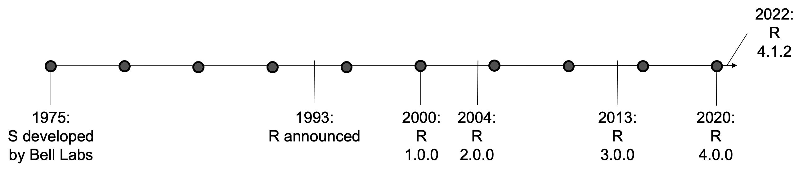
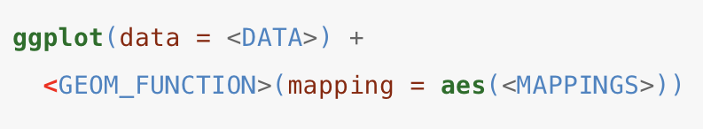

class: center, middle, inverse, title-slide

## Programming in R: a brief introduction
#### Jeremy Mack
#### Lehigh University - Digital Scholarship Team


---
class: center, middle, inverse, title-slide

## Programming in R: a brief introduction
#### Jeremy Mack
#### Lehigh University - Digital Scholarship Team
 &nbsp;  &nbsp; 
<br/><br/>
<br/><br/>
<br/>

---

### About this presentation

 * This course is a **brief introduction** into R.

--
 
 * It is targeted at people that have little to no experience
   progamming.

--
   
 * It could be useful for people who learned R some time ago and
   forgot it, or who are not familiar with modern R programming
   (`tidyverse`).

--

 * It focuses on a bit of history, an introduction to the R 
   environment, and some hands experience with **data wrangling**.

--

* Slides are available on [Lehigh's Research Computing site](https://confluence.cc.lehigh.edu/display/hpc/Seminars), [Wordpress](https://wordpress.lehigh.edu/jsm4/data-visualization/programming-in-r/), and Github ([slides](https://jeremymack-lu.github.io/rprog/) and [raw code](https://github.com/jeremymack-LU/rprog))
   
---

### Structure of the presentation

The presentation is split into seven topics:

 * [**Topic 1:**](<https://jeremymack-lu.github.io/rprog/#9>) What is R? Why use it?
 
 * [**Topic 2:**](<https://jeremymack-lu.github.io/rprog/#21>) What is RStudio? Why use it?
 
 * [**Topic 3:**](<https://jeremymack-lu.github.io/rprog/#33>) Getting started with R and RStudio
 
 * [**Topic 4:**](<https://jeremymack-lu.github.io/rprog/#59>) Objects and Functions
 
 * [**Topic 5:**](<https://jeremymack-lu.github.io/rprog/#99>) Data and Data Wrangling
 
 * [**Topic 6:**](<https://jeremymack-lu.github.io/rprog/#179>) Plotting
 
 * [**Topic 7:**](<https://jeremymack-lu.github.io/rprog/#202>) Other things to do with R

---
class: center, middle, inverse

#### Topic 1: What is R? Why use it?
<br/><br/>
<br/><br/>
<br/><br/>
<br/><br/>
<br/><br/>
<br/><br/>
---

#### Topic 1: What is R? Why use it?

.pull-left[
<center></center>
]

.pull-right[
- R is a **programming language** ([one of many](<https://www.tiobe.com/tiobe-index/>)) and an **environment** for statistical computing.
{{content}}
]

--

- Developed by Ross Ihaka and Robert Gentleman 27 years ago; it is now developed by a core team supported by the R Foundation.
{{content}}

--

- Dialect of the S language (S-Plus)
{{content}}
   
---

#### Topic 1: What is R? Why use it?

.pull-left[
<center></center>
]

.pull-right[
- R is a **programming language** ([one of many](<https://www.tiobe.com/tiobe-index/>)) and an **environment** for statistical computing.
   
- Developed by Ross Ihaka and Robert Gentleman 27 years ago; it is now developed by a core team supported by the R Foundation.

- Dialect of the S language (S-Plus)
]



---

#### Topic 1: What is R? Why use it?

.pull-left[
<center></center>
]

.pull-right[
- **Free!**
{{content}}
]

--

- Rich data analysis and visualization options
{{content}}

--

- Available on most platforms/OS
{{content}}
--

- **Very active development community**
    + CRAN: The Comprehensive R Archive Network
    + User contributed packages <br/> (> 16,000)
    {{content}}

--

- **Reproducibility**

---

#### Topic 1: What is R? Why use it?

 
##### - 2019 report by The National Academies of Sciences, Engineering, and Medicine

---

#### Topic 1: What is R? Why use it?

 &nbsp; &nbsp; &nbsp; 
##### - 2018 series featured in Nature

---
class: center, middle, inverse

#### Topic 2: What is RStudio? Why use it?
<br/><br/>
<br/><br/>
<br/><br/>
<br/><br/>
<br/><br/>
<br/><br/>
---

#### Topic 2: What is RStudio? Why use it?

.pull-left[

]

.pull-right[
* RStudio is a **company** that develops **free and open tools** for R, and enterprise-ready professional products.
{{content}}
]

--

* **Integrated Development Environment** (IDE), or a front end platform
to run R.
{{content}}

---

#### Topic 2: What is RStudio? Why use it?

.pull-left[

]

.pull-right[
* RStudio is a **company** that develops **free and open tools** for R, and enterprise-ready professional products.

* **Integrated Development Environment** (IDE), or a front end platform
to run R.
]


---

#### Topic 2: What is RStudio? Why use it?

.pull-left[

]

.pull-right[
* Like R, it's **free**!
{{content}}
]

--

* It can reduce the learning curve of R, by creating **organization**.
{{content}}

--

* Integrates nicely with other R features/applications:
    + Version control
    + R Markdown
    + ShinyApps

---

#### Topic 2: What is RStudio? Why use it?

How do R and RStudio work together? Consider a car analogy.

--

.pull-left[
**RStudio - the frame**
 - RStudio provides a frame that keeps things organized and finishings that make it visualling appealing.

**R - the engine**
 - R runs things under the hood - it's the enginge that allows the car to drive.
]

.pull-right[

]

---
class: inverse

#### Review - R and RStudio:

--

* **R** is a programming language built for statistical computing ("Engine").

 + It's open source and it's free.

--

* **RStudio** is an integrated development envrionment that makes working with R easier ("Frame").

 + It's developed by a company, but it's also free.

---

class: center, middle, inverse

#### Topic 3: Getting started with R and RStudio
<br/><br/>
<br/><br/>
<br/><br/>
<br/><br/>
<br/><br/>
<br/><br/>
---

#### Topic 3: Getting started with R and RStudio

How do I get R and RStudio?

--

* Download and local install:

 + You can download R on its own through the [R Project website](https://www.r-project.org).
   
 + You can download RStudio, including R,
   at the [RStudio website](https://rstudio.com/products/rstudio/download/).
   
--

* R and RStudio at Lehigh:

 + Both R and RStudio are available on [LUapps](https://luapps.lehigh.edu).
 
 + LUapps can be accessed both on campus and off-campus (over VPN).
 
<center></center>

---

#### Topic 3: Getting started with R and RStudio

First, let's explore RStudio.

[](https://luapps.lehigh.edu)

---

#### Topic 3: Getting started with R and RStudio

First, let's explore RStudio.


---

#### Topic 3: Getting started with R and RStudio
<style>
  pre {
    background-color: lightyellow;
    white-space: pre-wrap;
    line-height: 100%;
  }
</style>

Next, let's explore R - the engine under the hood.

In true computer science fashion, let's first try typing:

.tiny[
```{r eval=FALSE}
print("Hello world!")
```
]

What happend?

--

.tiny[
```{r echo=FALSE, comment=NA}
print("Hello world!")
```
]

---

#### Topic 3: Getting started with R and RStudio

Two things to note:

- We didn't just get "Hello world!", we also got `[1]`. This is R's way
of printing to the screen; it's telling us the position we're at.

- We didn't need to put anything at the end of the line, we just hit return.

---

#### Topic 3: Getting started with R and RStudio

Now, let's try three things...

Try capitalizing `Print(...)`:
 
.tiny[
```{r eval=FALSE}
Print("Hello world!")
```
]

Try putting a space between `print` and `("Hello world!")`:

.tiny[
```{r eval=FALSE}
print ("Hello world!")
```
]

Try just entering `"Hello world!"`:

.tiny[
```{r eval=FALSE}
"Hello world!"
```
]

What happened?

--
 
.tiny[
```{r echo=FALSE, error=TRUE, comment=NA}
Print("Hello world!")
```

```{r echo=FALSE, comment=NA}
print ("Hello world!")
```

```{r echo=FALSE, comment=NA}
"Hello world!"
```
]

---

#### Topic 3: Getting started with R and RStudio

Three things you just learned:

 - R is **case-sensitive**.
 
 - R does not care about **whitespace**.
 
 - R will **print** results by default.

---

#### Topic 3: Getting started with R and RStudio

You can also use R as a calculator. Let's try the following:

.tiny[
```{r eval=FALSE}
2 + 2
```
]
--
.tiny[
```{r echo=FALSE, comment=NA}
2 + 2
```
]
--
.tiny[
```{r eval=FALSE}
4 * 2
```
]
--
.tiny[
```{r echo=FALSE, comment=NA}
4 * 2
```
]
--
.tiny[
```{r eval=FALSE}
8 / 3
```
]
--
.tiny[
```{r echo=FALSE, comment=NA}
8 / 3
```
]
--
.tiny[
```{r eval=FALSE}
exp(log(8)-log(3))
```
]
--
.tiny[
```{r echo=FALSE, comment=NA}
exp(log(8)-log(3))
```
]

---
#### Topic 3: Getting started with R and RStudio
#### Assignments

We often want to save the results of our calculations, rather than print them to the screen. To do so, 
we'll use the **assignment operator**, `<-`

Here's an example:

.tiny[
```{r}
x <- log(8)
y <- log(3)
```
]

--
Now we can redo our last calculation using the assignments:

.tiny[
```{r comment=NA}
exp(x-y)
```
]

---
#### Topic 3: Getting started with R and RStudio
#### Concatenation

We will often want to work on sequences of values, rather than specific values. 

To do so, we'll use the **concatenation operator**, `c(...)`

Here's an example:

.tiny[
```{r}
n <- c(2, 3, 5, 8, 13, 21, 34, 55)
```
]

--

We can now apply opertions across the entire vector.

For example:

.tiny[
```{r comment=NA}
n * 2
```
]

---
#### Topic 3: Getting started with R and RStudio
#### Logicals

It can be useful to know whether our values meet certain conditions. 

In addition to **character values** (which we saw when we called `print("Hello world!")`), R also allows **logical values**, or `TRUE` and `FALSE`.

For example, we can check which numbers in our "n" vector are double digit:

.tiny[
```{r comment=NA}
n
is_double_digit <- n > 9
is_double_digit
```
]

---
class: inverse

#### Review - Getting started with R and RStudio:
* RStudio has four main windows to keep things organized.

* R is **case-sensitive**.

* R is a calculator.

* R can be used to store objects (**assignments**) that can be compared to other objects, or used with other functions.

---
class: center, middle, inverse

#### Topic 4: Objects and Functions
<br/><br/>
<br/><br/>
<br/><br/>
<br/><br/>
<br/><br/>
<br/><br/>

---

#### Topic 4: Objects and Functions

R revolves around two things: **objects** and **functions**. Almost everything in R is either an object or a function.

<center><b>Define objects > Apply functions > Repeat!</b></center>

--

For example, we can define a simple object called "n":

.tiny[
```{r}
n <- c(2, 3, 5, 8, 13, 21, 34, 55)
```
]

--

We can then apply a function to our object. Lets say we're interested in the average, so we'll apply the mean function:

.tiny[
```{r comment=NA}
mean(n)
```
]

---
#### Topic 4: Objects and Functions

Objects in R:
* Objects come in many different shapes and sizes - like a number, a dataset, a summary statistic, or the results of a statistical test.

--

* Objects have different **attributes** - properties that explain what an object represents and how it should be interpreted.

--

* Objects are essentially *data* that have a particular **type** and **structure**.

--

* There are five basic types in R:
 1. Numeric
 2. Integer
 3. Complex
 4. Logical
 5. Character
 
---
#### Topic 4: Objects and Functions

Objects in R - data types:
* Numeric - a number; default data type in R
 
.tiny[
```{r comment=NA}
x <- 10.5               # Define object x
x                       # Print x
class(x)                # Print the class name of x
```
]

---
#### Topic 4: Objects and Functions

Objects in R - data types:
* Integer - whole numbers; a number that is not a fraction

.tiny[
```{r comment=NA}
x <- 10                 # Define object x
x                       # Print x
class(x)                # Print the class name of x
```
]

---
#### Topic 4: Objects and Functions

Objects in R - data types:
* Integer - whole numbers; a number that is not a fraction

.tiny[
```{r comment=NA}
x <- as.integer(10)     # Convert to integer
x                       # Print x
class(x)                # Print the class name of x
```
]

--

.tiny[
```{r comment=NA}
x <- 10L                # Declare as integer by appending with "L"
x                       # Print x
class(x)                # Print the class name of x
```
]

---
#### Topic 4: Objects and Functions

Objects in R - data types:
* Complex - any number that can be written as a + bi, where *i* is the imaginary unit and a and b
are real numbers.

.tiny[
```{r, comment=NA}
x <- 1 + 2i             # Create a complex number x
x                       # Print the value of x 
class(x)                # Print the class name of x
```
]

---
#### Topic 4: Objects and Functions

Objects in R - data types:
* Logical - created via comparison(s) between variables.

.tiny[
```{r, comment=NA}
x <- 1; y <- 2          # Create sample values x and y
z <- x > y              # Is x larger than y? 
z                       # Print the logical value 
class(z)                # Print the class name of z
```
]

---
#### Topic 4: Objects and Functions

Objects in R - data types:
* Character - used to represent string values in R.

.tiny[
```{r, comment=NA}
x <- as.character(3.14) # Convert to character
x                       # Print the character string 
class(x)                # Print the class name of x
```
]

--

.tiny[
```{r comment=NA}
x <- "3.14"             # Can declare as character with " "
x                       # Print x
class(x)                # Print the class name of x
```
]

---
#### Topic 4: Objects and Functions

Objects in R:
* Objects come in many different shapes and sizes - like a number, a dataset, a summary statistic, or the results of a statistical test.

* Objects have different **attributes** - properties that explain what an object represents and how it should be interpreted.

* Objects are essentially *data* that have a particular **type** and **structure**.

* There are five basic **types** in R:
 1. Numeric
 2. Integer
 3. Complex
 4. Logical
 5. Character

---
#### Topic 4: Objects and Functions

Objects in R:
* Objects come in many different shapes and sizes - like a number, a dataset, a summary statistic, or the results of a statistical test.

* Objects have different **attributes** - properties that explain what an object represents and how it should be interpreted.

* Objects are essentially *data* that have a particular **type** and **structure**.

* There are four basic **structures** in R:
 1. Scalar
 2. Vector
 3. Matrix
 4. Data frame

---
#### Topic 4: Objects and Functions

Objects in R - data structure:

.pull-left[

]

.pull-right[
There are four types of data structures:
* Scalar
   
* Vector

* Matrix

* Data frame
]

---
#### Topic 4: Objects and Functions

Objects in R - data structure:

.pull-left[

]

.pull-right[
**Scalar objects:**
1. Hold only one value at a time.
 
2. Can be either numeric or character (but not both!).
 
3. Can be used to build more complex objects.

]
---
#### Topic 4: Objects and Functions

Objects in R - data structure:

.pull-left[

]

.tiny4.pull-right[
**Scalar objects:**
```{r comment=NA}
x <- 10.5 
x
str(x)
```

]

---
#### Topic 4: Objects and Functions

Objects in R - data structure:

.pull-left[

]

.pull-right[
**Vector objects:**
1. Hold several values stored as a single object.
 
2. Can be either numeric or character (but not both!).

]
---
#### Topic 4: Objects and Functions

Objects in R - data structure:

.pull-left[

]

.tiny4.pull-right[
**Vector objects:**
```{r comment=NA}
n <- c(2,3,5,8,13,21,34,55) 
n
str(n)
```

]

---
#### Topic 4: Objects and Functions

Objects in R - data structure:

.pull-left[

]

.tiny4.pull-right[
**Vector objects:**
```{r comment=NA}
n <- c(2,3,5,8,13,21,34,"55") 
n[1:6]
class(n)
```

]

---
#### Topic 4: Objects and Functions

Objects in R - data structure:

.pull-left[

]

.pull-right[
**Matrix objects:**
1. Large data structures.
 
2. Has 2-dimensions, representing its width and height.
 
3. Can be either numeric or character (but not both!).

] 
---
#### Topic 4: Objects and Functions

Objects in R - data structure:

.pull-left[

]

.tiny4.pull-right[
**Matrix objects:**
```{r comment=NA}
x <- 1:3
y <- 4:6
z <- 7:9
cbind(x,y,z)
rbind(x,y,z)
```

] 
---
#### Topic 4: Objects and Functions

Objects in R - data structure:

.pull-left[

]

.pull-right[
**Data frame objects:**
1. Large data structures.
 
2. Has 2-dimensions, representing its width and height.
 
3. Can be a mix of data types.

] 
---
#### Topic 4: Objects and Functions

Objects in R - data structure:

.pull-left[

]

.tiny4.pull-right[
**Data frame objects:**
```{r, comment=NA}
survey <- data.frame(
"index" = c(1,2,3,4,5),
"sex" = c("m","m","m","f","f"),
"age" = c(99,46,23,54,23))
```

```{r, comment=NA}
survey
```
]
---
class: inverse

#### Review - Objects:
* Define objects > Apply functions > Repeat!

* Objects are defined by data. There are five main types of data:
   1. Numeric
   2. Integer
   3. Complex
   4. Logical
   5. Character

* Objects come in different sizes and shapes, from a single, scalar, object, to a data frame that contains multiple vectors of different data types.
   1. Scalar - single value
   2. Vector - string of values, same data type
   3. Matrix - multiple strings, same data type
   4. Data frame - multiple strings, different data types

---
#### Topic 4: Objects and Functions

R revolves around two things: **objects** and **functions**. Almost everything in R is either an object or a function.

<center><b>Define objects > Apply functions > Repeat!</b></center>

---
#### Topic 4: Objects and Functions

Functions in R:

* Functions are procedures that typically take one or more objects as **arguments** (i.e., inputs), does something with them, then returns a new object (i.e., result).

--

* Functions vary in complexity - like computing a mean, to a statistical test.

--

* How do we get functions loaded into R?
 1. Write your own.

 2. Community development (**Packages**)!

---
#### Topic 4: Objects and Functions

Packages in R:

* R packages are collections of functions developed by the [R community](<https://cran.case.edu>).

--

* Packages also include data sets, help documentation, and how-to examples (i.e., vignette).

--

* When you download and install R for the first time, you are installing the [base R](<https://stat.ethz.ch/R-manual/R-devel/library/base/html/00Index.html>) - only functions written by the original authors of the R language.

--

* How de we get ~~functions~~ packages loaded into R?

---
#### Topic 4: Objects and Functions

Packages in R:

* How de we get packages loaded into R? Install and load.

 + Programmatically
.tiny[
```{r comment=NA, eval=FALSE}
install.packages("ggplot2"); library("ggplot2")
```
]

--
 + RStudio Explorer window
 
  
 
---
class: inverse

#### Review - Functions and Packages:
* Define objects > Apply functions > Repeat!

* Functions are used to work with objects in R and are loaded via packages.

* Standard functions are a part of base R, a series of packages that load automatically when R is opened.

* There is a large community of users that develop packages for R.

* Packages can loaded programmatically by first installing with install.packages("...") and then loading with library(...).

* Packages can also be installed and loaded in the Explorer window in RStudio.

---
class: center, middle, inverse

#### Topic 5: Data and Data Wrangling
<br/><br/>
<br/><br/>
<br/><br/>
<br/><br/>
<br/><br/>
<br/><br/>
---
#### Topic 5: Data and Data Wrangling

<center></center>

---
#### Topic 5: Data and Data Wrangling

Basic steps to working with data in R:

--

 * Check and/or set a working directory.

--

  + What is my working directory?
.tiny[
```{r, comment=NA}
getwd()                  # Prints current working directory
```
]

--

  + How do I set my working directory?
.tiny[
```{r, comment=NA, eval=FALSE}
setwd("h:/R_workshop")   # Sets path to working directory
getwd()                  # Prints current working directory
```

```
[1] "h:/R/R_workshop"
```
]

--

  + Can also set working directory in RStudio:
   
     1. Session > Set Working Directory > Choose Directory...
     
     2. Explorer window > More > Set As Working Directory
   
---
#### Topic 5: Data and Data Wrangling

Basic steps to working with data in R:

 * Check and/or set a working directory.
 
--

 * Load data.

--
 
  + Programmatically:
.tiny[
```{r, comment=NA, eval=FALSE}
read.table()   # base R
read.csv()     # base R
read.delim()   # base R
read_xlsx()    # Available with readxl package
```
]

--

  + Can also load data in RStudio:
   
     1. File > Import Dataset
     
     2. Workspace window > Import Dataset

---
#### Topic 5: Data and Data Wrangling

Basic steps to working with data in R:

 * Check and/or set a working directory.

 * Load data.
 
 * Explore data!

---
#### Topic 5: Data and Data Wrangling

Exploring Data in R

 * Let's explore data in R.
 
--
 
 * R comes with **pre-loaded datasets**, but let's use a dataset from the web to practice saving to and loading from a working directory.
 
--

 * Basic steps:
  
   1. Set working directory.
   
   2. Load data.
   
   3. Explore data!
 
---
#### Topic 5: Data and Data Wrangling

Exploring Data in R

 * First, using the Explorer window in RStudio, create a folder called "R".

--

 * Next, we'll set our working directory and download our dataset:

.tiny[
```{r, comment=NA, eval=FALSE}
# Set working directory
setwd("h:/R")

# Set url link for data download
url <- "https://wordpress.lehigh.edu/jsm4/files/2020/02/mpg.txt"

# Download file to working directory
download.file(url, "mpg.txt")
```
]

--

 * Now, let's load our data:

.tiny[
```{r, comment=NA}
df <- read.table("mpg.txt", header=TRUE, sep=",")
```
]

---
#### Topic 5: Data and Data Wrangling

Exploring Data in R
 
 * Helpful functions for exploring data in R:
 
.tiny[
```{r comment=NA, eval=FALSE}
View(df)      # View the dataset in a spreadsheet

str(df)       # Print the structure of the data frame
  
head(df)      # Print the first few rows
  
tail(df)      # Print the last few rows
  
nrow(df)      # Print the number of rows
  
ncol(df)      # Print the number of columns
  
dim(df)       # Print the dimensions (rows x columns)
  
rownames(df)  # Print row names
  
colnames(df)  # Print column names
```
]
 
---
#### Topic 5: Data and Data Wrangling

Exploring Data in R

.tiny[  * Let's check to make sure our data loaded correctly:
```{r, comment=NA}
head(df)
```
]

---
#### Topic 5: Data and Data Wrangling

Exploring Data in R

.tiny[ * Next, we'll check our data structure:
```{r, comment=NA}
str(df)
```
]

---
#### Topic 5: Data and Data Wrangling

Exploring Data in R

.tiny[  * Selecting specific data in R:
  
   + R reads data as row x column, using brackets [r,c]
  
```{r comment=NA}
df[1,1]  # Print value in row 1, column 1
df[6,10] # Print value in row 6, column 10
```
]

---
#### Topic 5: Data and Data Wrangling

Exploring Data in R

.tiny[  * Selecting specific data in R:
  
   + What if we wanted to print just row 1?
   
```{r comment=NA}
df[1,]  # Print the first row 
```
]

---
#### Topic 5: Data and Data Wrangling

Exploring Data in R

  * Selecting specific data in R:
  
   + What if we wanted to print just column 1?
   
.tiny[
```{r comment=NA, eval=FALSE}
df[,1]   # Print column 1 by number (as a vector)
```
]
.tiny[   
```{r comment=NA, echo=FALSE}
x <- df[,1]
x[1:98]
```
]

---
#### Topic 5: Data and Data Wrangling

Exploring Data in R

  * Selecting specific data in R:
  
   + What if we wanted to print just column 1?

.tiny[
```{r comment=NA, eval=FALSE}
df$manufacturer  # Print column 1 by name (as a vector)
```
]

.tiny[
```{r comment=NA, echo=FALSE}
y <- df$manufacturer
y[1:98]
```
]

---
#### Topic 5: Data and Data Wrangling

Summarizing Data in R
 
 * Helpful functions for summarizing data in R:
 
.tiny[
```{r comment=NA, eval=FALSE}
mean(x)        # Calculate and return the average of the input values

max(x)         # Return the maximum value of the input values
  
min(x)         # Return the minimum value of the input values
  
sd(x)          # Calculate and return the standard deviation of the input values
  
length(x)      # Print the set length of the input values
```
]

---
#### Topic 5: Data and Data Wrangling

Summarizing Data in R

 * Helpful functions for summarizing data in R:
 
  + What if we wanted to summarize the highway mpg data in our dataset?
 
.tiny[
```{r comment=NA}
mean(df$hwy)  # Average value for hwy
```
]
--
.tiny[
```{r comment=NA}
max(df$hwy)   # Maximum value for hwy
```
]
--
.tiny[
```{r comment=NA}
min(df$hwy)   # Minimum value for hwy
```
]
--
.tiny[
```{r comment=NA}
sd(df$hwy)    # Standard deviation for hwy
```
]

---
#### Topic 5: Data and Data Wrangling

Summarizing Data in R

 * Helpful functions for summarizing data in R:
 
  + What happens if there are missing data?

.tiny[
```{r comment=NA}
df2      <- df
df2[1,9] <- NA
df2[1,]
```
]
--
.tiny[
```{r comment=NA}
mean(df2$hwy)  # Average value for mpg
```
]
--
.tiny[
```{r comment=NA}
# Need to pay attention to additional arguments
mean(df2$hwy, na.rm=TRUE)
```
]

---
#### Topic 5: Data and Data Wrangling

Summarizing Data in R

 * What if we wanted to add a new variable (i.e., column)?
 
.tiny[
```{r comment=NA}
# Let's add a new column of the average mpg
df$avg  <- rowMeans(df[,8:9], na.rm=TRUE)
```
]

.tiny[
```{r comment=NA, echo=FALSE}
# Let's add a new column of with row sum
df[1:5,]
```
]

---
#### Topic 5: Data and Data Wrangling

Analyzing Data in R
 
 * Helpful functions for analyzing data in R:
 
.tiny[
```{r comment=NA, eval=FALSE}
lm(x)           # Apply a linear model

glm(x)          # Apply a generalized linear model
  
t.test(x)       # Perform a t-test for difference between means
  
aov(x)          # Analysis of variance test
  
prop.test(x)    # Test for a difference between proportions
```
]

---
#### Topic 5: Data and Data Wrangling

Analyzing Data in R

 * How does highway mileage change with engine displacement?
 
.tiny[
```{r comment=NA, eval=FALSE}
# Quick plot of the data
with(df, plot(x=displ, y=hwy))
```
]
<center></center>

---
#### Topic 5: Data and Data Wrangling

Analyzing Data in R

 * How does highway mileage change with engine displacement?
 
.tiny[
```{r comment=NA, eval=FALSE}
# Apply a simple linear model
mod <- lm(hwy~displ, data=df)
summary(mod)
```
]

.tiny2[
```{r comment=NA, echo=FALSE}
# Apply a simple linear model
mod <- lm(hwy~displ, data=df)
summary(mod)
```
]

---
#### Topic 5: Data and Data Wrangling

Analyzing Data in R

 * Does highway mileage significantly differ between car classes?
 
.tiny[
```{r comment=NA, eval=FALSE}
# Quick plot of the data
with(df, plot(x=class, y=hwy))
```
]
<center></center>

---
#### Topic 5: Data and Data Wrangling

Analyzing Data in R

 * Does highway mileage significantly differ between car classes?
 
.tiny[
```{r comment=NA, eval=FALSE}
# Apply a simple linear model with an ANOVA test
mod2 <- lm(hwy~class, data=df)
aov2 <- aov(mod2)
summary(aov2)
```
]

.tiny2[
```{r comment=NA, echo=FALSE}
# Apply a simple linear model with an ANOVA test
mod2 <- lm(hwy~class, data=df)
aov2 <- aov(mod2)
summary(aov2)
```
]

---
class: inverse

#### Exercise - Summarizing Data:
 * The *USArrests* dataset provides data on the number of arrests per 100,000 residents for violent crimes (assault, murder, and rape) in each of the 50 US states in 1973.

--

 * First assign that data to an object called "crime"
.tiny[
```{r comment=NA}
crime <- USArrests
```
]

--

 * Using that data, try the following:
  1. Calculate average number of arrests for assault.
  
  2. Identify maximum number of arrests for assault.
  
  3. Print the statistics for Pennsylvania.
  
  4. Was there a linear relationship between murders and assaults?
    
--

 * How did you do?

---
#### Review - Summarizing Data:

 * Calculate average number of arrests for assault.

--

.tiny[
```{r, comment=NA}
mean(crime$Assault)
```
]

--

.tiny[
```{r, comment=NA}
mean(crime[,2])
```
]

--

.tiny[
```{r, comment=NA}
sum(crime$Assault)/length(crime$Assault)
```
]

---
#### Review - Summarizing Data:

 * Identify maximum number of arrests for assault.

--
 
.tiny[
```{r, comment=NA}
max(crime$Assault)
```
]

--

.tiny[
```{r, comment=NA}
x <- sort(crime$Assault, decreasing=TRUE)
x[1]
```
]

--

.tiny[
```{r, comment=NA}
x <- sort(crime$Assault)
x[50]
```
]

---
#### Review - Summarizing Data:

 * Print the statistics for Pennsylvania.

--

.tiny[
```{r, comment=NA}
crime["Pennsylvania",]
```
]

--

.tiny[
```{r, comment=NA}
crime[38,]
```
]

---
#### Review - Summarizing Data:

 * Was there a linear relationship between murders and assaults?

--

.tiny[
```{r comment=NA, eval=FALSE}
# Quick plot of the data
with(crime, plot(x=Assault, y=Murder))
```
]
<center></center>

---
#### Review - Summarizing Data:

 * Was there a linear relationship between murders and assaults?

.tiny[
```{r comment=NA, eval=FALSE}
# Apply a simple linear model
mod <- lm(Murder~Assault, data=crime)
summary(mod)
```
]

.tiny2[
```{r comment=NA, echo=FALSE}
# Apply a simple linear model
mod <- lm(Murder~Assault, data=crime)
summary(mod)
```
]

---
#### Topic 5: Data and Data Wrangling
Exploring and Summarizing Data in R

  * So far, we've used base R commands and functions to explore and summarize data.
  
--

* Let's take a look at the [(Tidyverse)](<https://www.tidyverse.org)!
 
.pull-right[
<center></center>
]

---
#### Topic 5: Data and Data Wrangling
Exploring and Summarizing Data in R

<center></center>

---
#### Topic 5: Data and Data Wrangling
Exploring and Summarizing Data in R

<center></center>

---
#### Topic 5: Data and Data Wrangling
Exploring and Summarizing Data in R

 * Let's load a core Tidyverse packages:

```{r comment=NA, echo=FALSE, message=FALSE, warning=FALSE}
library(dplyr)
```

.tiny[
```{r comment=NA, eval=FALSE}
install.packages("dplyr"); library(dplyr)
```
]

--

 * Working with the pipe operator (%>%) - **magrittr**
 
--
 
  + This operator forwards an object, into the next function.
  
--
  
  + Perform multiple functions, without nesting, or looping.

---
#### Topic 5: Data and Data Wrangling
Exploring and Summarizing Data in R  
  
 * For example, in our *mpg* dataset, let's say we're interested in the average highway mpg in cars in 2008, based on their number of cylinders.

--
 
  + Nesting approach:
  
.tiny.pull-left[
```{r comment=NA, echo=FALSE, message=FALSE, include=FALSE}
library(dplyr)
library(ggplot2)
```

```{r comment=NA, message=FALSE, eval=FALSE}
arrange(
   summarize(
       group_by(
        filter(df,year==2008),
        cyl
          ),
       Avg = mean(hwy)
      ),
   desc(Avg)
 )
```
]

.tiny.pull-right[
```{r comment=NA, message=FALSE, echo=FALSE}
arrange(
   summarize(
       group_by(
        filter(df,year==2008),
        cyl
          ),
       Avg = mean(hwy)
      ),
   desc(Avg)
 )
```
]

---
#### Topic 5: Data and Data Wrangling
Exploring and Summarizing Data in R  
  
 * For example, in our *mpg* dataset, let's say we're interested in the average highway mpg in cars in 2008, based on their number of cylinders.
 
  + Multiple objects approach:
  
.tiny.pull-left[
```{r comment=NA, echo=FALSE, message=FALSE}
library(dplyr)
library(ggplot2)
```

```{r comment=NA, message=FALSE, eval=FALSE}
a <- filter(df, year==2008)
b <- group_by(a, cyl)
c <- summarize(b,
               Avg=mean(hwy))
d <- arrange(c, desc(Avg))
print(d)
```
]

.tiny.pull-right[
```{r comment=NA, message=FALSE, echo=FALSE}
a <- filter(df, year==2008)
b <- group_by(a, cyl)
c <- summarize(b, Avg=mean(hwy))
d <- arrange(c, desc(Avg))
print(d)
```
]

---
#### Topic 5: Data and Data Wrangling
Exploring and Summarizing Data in R  
  
 * For example, in our *mpg* dataset, let's say we're interested in the average highway mpg in cars in 2008, based on their number of cylinders.
 
  + Piping approach:
  
.tiny.pull-left[
```{r comment=NA, echo=FALSE, message=FALSE}
library(dplyr)
library(ggplot2)
```

```{r comment=NA, message=FALSE, eval=FALSE}
df %>%
   filter(year==2008) %>%
   group_by(cyl) %>%
   summarize(Avg=mean(hwy)) %>%
   arrange(desc(Avg))
```
]

.tiny.pull-right[
```{r comment=NA, message=FALSE, echo=FALSE}
df %>%
   filter(year==2008) %>%
   group_by(cyl) %>%
   summarize(Avg=mean(hwy)) %>%
   arrange(desc(Avg))
```
]

---
#### Topic 5: Data and Data Wrangling

Exploring and Summarizing Data in R
 
 * Helpful functions - **Tidyverse**:
 
.tiny[
```{r comment=NA, eval=FALSE}
filter(x)      # picks cases based on their values.

select(x)      # picks variables based on their names
  
arrange(x)     # changes the ordering of rows
  
group_by(x)    # allows operations by groups
  
mutate(x)      # adds new variables to a dataset
  
summarise(x)   # reduces multiple values down to a summary value
  
add_row(x)     # add a row of data to a data frame
```
]
  
---
class: inverse

#### Exercise - Summarizing Data:
 * The *mpg* dataset provides data on fuel efficiency for a variety of vehicles in 1999 and 2008.

--

 * Using that data and the piping method:
  1. What manufacturer had the highest highway mpg in 1999? Was it the same one in 2008?
  
  2. Based on number of cylinders, calculate the average highway and city mpg, in both 1999 and 2008, as well as the difference bewteen highway and city mpg.
    
--

 * How did you do?
 
---
#### Exercise - Summarizing Data:

 * What manufacturer had the highest highway mpg in 1999? Was it the same one in 2008?

--

.tiny[
```{r comment=NA, eval=FALSE}
df %>% filter(year==1999) %>% 
   arrange(desc(hwy)) %>% 
   head(1)
```

```{r comment=NA, echo=FALSE}
df %>% filter(year==1999) %>% 
   arrange(desc(hwy)) %>% 
   head(1)
```
]

--

.tiny[
```{r comment=NA, eval=FALSE}
df %>% filter(year==2008) %>% 
   arrange(desc(hwy)) %>% 
   head(1)
```

```{r comment=NA, echo=FALSE}
df %>% filter(year==2008) %>% 
   arrange(desc(hwy)) %>% 
   head(1)
```
]

---
#### Exercise - Summarizing Data:

 * What manufacturer had the highest highway mpg in 1999? Was it the same one in 2008?
 
.tiny[
```{r comment=NA, eval=FALSE}
df %>% group_by(year) %>%
   filter(hwy == max(hwy))
```

```{r comment=NA, echo=FALSE}
df %>% group_by(year) %>%
   filter(hwy == max(hwy))
```
]

---
#### Exercise - Summarizing Data:

 * Based on number of cylinders, calculate the average highway and city mpg, in both 1999 and 2008, as well as the difference bewteen highway and city mpg.

--

.tiny[
```{r comment=NA, warning=FALSE, message=FALSE}
df %>%
   group_by(cyl,year) %>%
   summarize(Avg_hwy=mean(hwy, na.rm=TRUE),
             Avg_cty=mean(cty, na.rm=TRUE)) %>%
   mutate(Diff=Avg_hwy-Avg_cty)
```
]


---
class: inverse

#### Review - Data and Data Wrangling:
* Working directories and data can be loaded both programmatically and using the RStudio interface.

* R reads data within brackets as row x column.

* Pay attendtion to function arguments - missing values can cause problems.

* Tidyverse packages provide a programming grammar that simplifies applying multiple functions.


---
class: center, middle, inverse

#### Topic 6: Plotting
<br/><br/>
<br/><br/>
<br/><br/>
<br/><br/>
<br/><br/>
<br/><br/>

---
#### Topic 6: Plotting

Visualizing data in R

<center><b>“The simple graph has brought more information to the data analyst’s mind than any other device.” - John Tukey</b></center>

--

<center></center>

---
#### Topic 6: Plotting

Visualizing data in R

 * Let's explore visualizing data in R, using **ggplot2** - a Tidyverse package.

--

 * Basic steps:
  
   1. Set working directory.
   
   2. Load data.
   
   3. Explore data!
   
---
#### Topic 6: Plotting

Visualizing data in R

 * Let's explore visualizing data in R, using **ggplot2** - a Tidyverse package.

 * Basic steps:
  
   1. Set working directory.
   
   2. Load data.
   
   3. ~~Explore data!~~ Visualize data!

---
#### Topic 6: Plotting
Visualizing data in R
.pull-left2[
* Tidyverse - **ggplot2**
]

.pull-right2[
<center></center>]

---
#### Topic 6: Plotting
Visualizing data in R

.pull-left2[
* Tidyverse - **ggplot2**

* Layered approach to building graphics
]

.pull-right2[
<center></center>]

---
#### Topic 6: Plotting
Visualizing data in R

.pull-left2[
* Tidyverse - **ggplot2**

* Layered approach to building graphics
 + Required arguments
 
 + Sensible defaults
]

.pull-right2[
<center></center>
<center></center>
]

---
#### Topic 6: Plotting
Visualizing data in R

.pull-left2[
* Tidyverse - **ggplot2**

* Layered approach to building graphics
 + Required arguments
 
 + Sensible defaults
 
* Basic template has three functions:
  + **ggplot** - creates a blank canvas
  
  + **geom** - adds a layer
  
  + **aes** - visual properties of an object
]

.pull-right2[
<center></center>
<center></center>
]

---
#### Topic 6: Plotting

Visualizing data in R

 * Let's try the first function by itself. What happened?

```{r comment=NA, echo=FALSE, warning=FALSE}
library(ggplot2)
```

.tiny[
```{r comment=NA, eval=FALSE}
ggplot(data=df)
```
]

---
#### Topic 6: Plotting

Visualizing data in R

<center></center>
 
---
#### Topic 6: Plotting

Visualizing data in R

 * Let's try the first function by itself. What happened?

.tiny[
```{r comment=NA, eval=FALSE}
ggplot(data=df)
```

 * Now lets add some layers and aestechics, with the second and third functions.

```{r comment=NA, eval=FALSE}
ggplot(data=df) +
geom_point(mapping=aes(x=displ, y=hwy))
```
]

---
#### Topic 6: Plotting

Visualizing data in R

<center></center>

---
#### Topic 6: Plotting

Visualizing data in R

 * Let's try the first function by itself. What happened?

.tiny[
```{r comment=NA, eval=FALSE}
ggplot(data=df)
```

 * Now lets add some layers and aestechics, with the second and third functions.

```{r comment=NA, eval=FALSE}
ggplot(data=df) +
geom_point(mapping=aes(x=displ, y=hwy))
```

 * Now lets add an additional **aesthetic**.

```{r comment=NA, eval=FALSE}
ggplot(data=df) +
geom_point(mapping=aes(x=displ, y=hwy, color=class))
```
]

---
#### Topic 6: Plotting

Visualizing data in R

<center></center>

---
#### Topic 6: Plotting

Visualizing data in R

 * We can also add additional layers [geoms](<https://rstudio.com/wp-content/uploads/2015/03/ggplot2-cheatsheet.pdf>).

.tiny[
```{r comment=NA, eval=FALSE}
ggplot(data=df) +
geom_point(mapping=aes(x=displ, y=hwy, color=class)) +
geom_smooth(mapping=aes(x=displ, y=hwy), method="lm")
```
]

---
#### Topic 6: Plotting

Visualizing data in R

<center></center>

---
#### Topic 6: Plotting

Visualizing data in R

 * We can also add additional layers [geoms](<https://rstudio.com/wp-content/uploads/2015/03/ggplot2-cheatsheet.pdf>).
 
.tiny[
```{r comment=NA, eval=FALSE}
ggplot(data=df) +
geom_point(mapping=aes(x=displ, y=hwy, color=class)) +
geom_smooth(mapping=aes(x=displ, y=hwy), method="lm")
```
]

.pull-right2[
<center></center>
]

---
#### Topic 6: Plotting

Visualizing data in R

 * Now, let's clean the plot up a bit.

.tiny[
```{r comment=NA, eval=FALSE}
 ggplot(mpg, aes(x=displ, y=hwy)) +
  theme(plot.background=element_blank(),
        panel.border=element_blank(),
        panel.background=element_blank(),
        axis.ticks=element_line(size=0.25),
        axis.text=element_text(size = 7),
        axis.line=element_line(size=0.25),
        axis.title=element_text(size = 7),
        legend.text=element_text(size = 7),
        legend.title=element_text(size = 7),
        legend.key=element_blank(),
        plot.title=element_text(hjust=.5, size=8)) +
    geom_point(aes(color=class),size=0.25) +
    geom_smooth(method="lm", size=0.25) +
    labs(title="Highway mileage by engine displacement",
         x="Engine displacement (L)",
         y="Highway miles per gallon",
         color="Vehicle class")
```
]

---
#### Topic 6: Plotting

Visualizing data in R

<center></center>

---
#### Topic 6: Plotting

Visualizing data in R

<center></center>

---
class: inverse

#### Review - Plotting:
* Data can look quantitatively the same, but qualitatively different.

* **ggplot2** package in R uses a layered approach to plotting.

* More on visualizing data next week...

---
class: center, middle, inverse

#### Topic 7: Other things to do with R
<br/><br/>
<br/><br/>
<br/><br/>
<br/><br/>
<br/><br/>
<br/><br/>
---

#### Topic 7: Other things to do with R

.right-column2[
<center>
<br/><br/>
<center>
]

.left-column2[
* [R Markdown documents](<https://rmarkdown.rstudio.com>)
 - Documents
 - Websites
 - Books
<br/><br/>
<br/><br/>
<br/><br/>
* [Shiny Apps](<https://jeremymack.shinyapps.io/covid19/>)
 - Web applications
 - Websites
 - Dashboards 
]